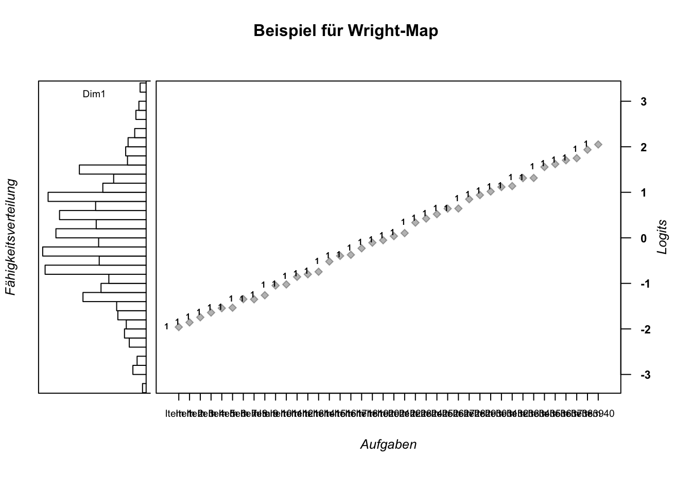

## Laden der benötigten Pakete und des Datensatzes
Da jede Anwendung der Software _R_ die Nutzung von Paketen vorsieht, sind diese hier aufgelistet. Der geladene Datensatz wird mit dem "TAM"-Paket mitgeliefert.


```r
library(TAM) # TAM-Paket als zentrales Paket
library(WrightMap) # zur Erzeugung von Wright-Maps
data(data.sim.rasch) # Lerndatensatz mit 2000 Personen & 40 Items, integriert in das TAM-Paket
```

### Paketquellen
- "TAM": Robitzsch, A., Kiefer, T., & Wu, M. (2019). TAM: Test Analysis Modules. R package version 3.5-19. https://CRAN.R-project.org/package=TAM
- Torres Irribarra, D. & Freund, R. (2014). Wright Map: IRT item-person map with ConQuest integration. Available at http://github.com/david-ti/wrightmap

## Modellschätzung
Der folgende Code initiiert die Schätzung eines Rasch-Modells für den vorliegenden Datensatz. Das Listen-Objekt `mod1PL` mit vielen Einträgen wird erzeugt.


```r
# Model 1: Rasch model (MML estimation)
mod1PL <- TAM::tam.mml(resp=data.sim.rasch)
```

Folgend wird das Dataframe-Objekt `mod1PL$item` aus dem Listen-Objekt `mod1PL` ausgewählt und ausgegeben. Es enthält verschiedene Spalten mit deskriptiven Kennwerten:


```r
# Ausgabe der ersten 6 von 40 Itemkennwerten
head(mod1PL$item)
##    item    N      M  xsi.item AXsi_.Cat1 B.Cat1.Dim1
## I1   I1 2000 0.8270 -1.959068  -1.959068           1
## I2   I2 2000 0.8145 -1.857078  -1.857078           1
## I3   I3 2000 0.8000 -1.744487  -1.744487           1
## I4   I4 2000 0.7860 -1.640799  -1.640799           1
## I5   I5 2000 0.7725 -1.544854  -1.544854           1
## I6   I6 2000 0.7710 -1.534415  -1.534415           1
```
- `item`: Laufnummer der jeweiligen Items.

- `N`: Anzahl an Personen, die das jeweilige Item bearbeitet haben.

- `M`: Deskriptive Schwierigkeit des Items ($M = \frac{N_{korrekt}}{N_{gelöst}}$).

- `xsi.item`: *xsi* wird ausgesprochen wie geschrieben und bezieht sich auf den griechischen Buchstaben ($\xi$). Der $\xi$-Parameter ist die, mit dem Modell geschätzte, Aufgabenschwierigkeit auf der Skala von $-\infty$ bis $\infty$ mit 0 als Mittelwert. Übliche Werte in der Praxis liegen zwischen -3 bis 3. Eine Aufgabe mit Schwierigkeit $\xi=1$ ist dabei schwerer als eine Aufgabe mit Schwierigkeit $\xi=0$. Oft findet man den Schwierigkeitsparameter auch unter anderen griechischen Buchstaben in der Literatur, z. B. $\delta$ oder $\beta$. TAM übernimmt die Notation mit $\beta$ unter der Bezeichnung *IRT parametrization*. Siehe dazu das folgende Dataframe-Objekt `mod1PL$item_irt`.


```r
# Ausgabe der ersten 6 von 40 Itemkennwerten unter IRT-Parametrisierung
head(mod1PL$item_irt)
##   item alpha      beta
## 1   I1     1 -1.959068
## 2   I2     1 -1.857078
## 3   I3     1 -1.744487
## 4   I4     1 -1.640799
## 5   I5     1 -1.544854
## 6   I6     1 -1.534415
```

- `AXsi_.Cat1`: Da im gezeigten Beispiel nur ein eindimensionales Modell ohne weitere Bedingungen berechnet wurde, entspricht der Wert dem $\xi$-Parameter, d. h. der Schwierigkeit. Unter anderen Bedingungen (beispielsweise Mehrdimensionalität, oder verschiedenen Testheftpositionen der Aufgabe), können verschiedende, bedingte Schwierigkeiten auftreten. Dazu ein fiktives, vereinfachtes Beispiel: Eine Aufgabe ist in zwei verschiedenen Testheften zu finden. In Testheft Nr. 1 ist sie immer die erste Aufgabe, in Testheft Nr. 2 ist sie immer die letzte Aufgabe. Die Testheftposition kann im statistischen Modell berücksichtigt werden und es würden dann zwei testheftabhängige Schwierigkeitsparameter berechnet, die sich als `AXsi_.Cat1` und `AXsi_.Cat2` im Output wiederfinden würden.

- `B.Cat1.Dim1`: Steigungsparameter. Im eindimensionalen 1-PL-Modell wird der B-Parameter nicht berechnet, sondern auf $B=1$ fixiert. Oft findet man den Steigungsparameter auch unter der Bezeichnung $\alpha$ (siehe Output oben zu `xsi.item`).

### Deutung der Aufgabenschwierigkeiten
Die erhaltenen Schwierigkeitsparameter stehen unter dem Vorbehalt, dass das Rasch-Modell gültig ist (**VERWEIS**). Sie setzen die Aufgaben nun jenseits von subjektiven Einflüssen miteinander in Beziehung. War eine Schwierigkeitseinschätzung a-priori (bspw. durch ein Expertenrating) noch von zahlreichen, personenabhängigen Einflüssen getragen, sind nun die Bearbeitungserfolge durch die Zielgruppe in der quantitativ-empirischen Erhebung integriert: Die Schwierigkeiten wurden gemessen und nicht über den Daumen gepeilt. Noch vor weiterführenden Analysen können die so erhaltenen, quantitativen Befunde wiederum durch qualitative Urteile abgeglichen werden: 

- Gibt es Aufgaben, die erwartungsgemäß schwerer/leichter waren als andere?
- Gibt es Aufgaben, deren Schwierigkeiten *nicht* erwartungskonform sind?
- War eine Aufgabe vielleicht zu einfach, weil die Distraktoren unpassend gewählt waren?
- ...

Die Aufgabenentwicklung führt so in einem Zusammenspiel aus objektiven Kriterien und subjektiver Synthese (bspw. Erfahrung von PraktikerInnen, Literaturrecherche, curriculare Anforderungen) zu validen und reliablen Testinstrumenten.

## Erzeugen einer Wright-Map
Mit einem Mathematiktest für GrundschülerInnen wird es kaum möglich sein, verschiedene Studierende der Mathematik und ihrer Fähigkeit zu rechnen zu unterscheiden. Analoges gilt für einen zu schweren Test für die GrundschülerInnen.

Für Leistungstests ist also eine breite Verteilung von Aufgabenschwierigkeiten über die Personenfähigkeiten wünschenswert. Wright-Maps erlauben eine Prüfung der Abdeckung, indem sie die Aufgabenschwierigkeiten und die Personenfähigkeiten grafisch miteinander in Beziehung setzen. Es wird dabei auf einen Blick deutlich, wenn in einem bestimmten Schwierigkeits-/Fähigkeitsintervall zu wenige oder zuviele Aufgaben vorliegen. Dies ist insbesondere in der Pilotierungsphase eines Tests hilfreich.

Das folgende Code-Beispiel schätzt die Personenfähigkeiten und schreibt sie in das Objekt `thetas_1pl`. Außerdem werden die Aufgabenschwierigkeiten separat als Objekt `item_xsis_1pl` abgespeichert um anschließend mit der Funktion `wrightMap()` eine automatische Visualisierung zu erhalten (**ABBILDUNG**).


```r
thetas_1pl <- tam.wle(mod1PL) # WLEs berechnen
item_xsis_1pl <- mod1PL$xsi$xsi # Itemschwierigkeiten separieren

wrightMap(thetas_1pl$theta, item_xsis_1pl,
          main.title = "Beispiel für Wright-Map",
          axis.persons = "Fähigkeitsverteilung",
          axis.items = "Aufgaben")
```

<div class="figure">

<p class="caption">(\#fig:wright-map1)Abb. XYZ: Eine Variante für eine Wright-Map.</p>
</div>

Gut erkennbar ist die Fähigkeitsverteilung in Dimension 1 (schmaleres Panel links) und die numerische Zuordnung der Aufgaben zu dieser Dimension (breiteres Panel rechts). Ebenfalls deutlich wird die Äquivalenz von Personenfähigkeiten und Aufgabenschwierigkeiten, erkennbar an der Logit-Skala auf der rechten Seite.

Ungünstig ist die kategorische Aufgaben-Achse. Da der Datensatz 40 Aufgaben enthält, resultiert ein Overplot der Aufgaben-Namen, dem mit einer Alternativdarstellung begegnet werden kann (**ABBILDUNG**).


```r
wrightMap(thetas_1pl$theta, item_xsis_1pl, 
          item.side = itemClassic,
          main.title = "Beispiel für Wright-Map",
          axis.persons = "Fähigkeitsverteilung",
          axis.items = "Aufgabenverteilung")
```

<div class="figure">

<p class="caption">(\#fig:wright-map2)Abb. ABC: Eine Alternative Darstellung der Wright-Map.</p>
</div>

In diesem Fall ist gut zu sehen, wie die Aufgaben - markiert durch ihren Laufindex aus dem Datensatz - von unten nach oben schwieriger werden. Außerdem erkennbar: Die Aufgaben sind näherungsweise uniform über das Schwierigkeits-/Fähigkeitsintervall verteilt. Außerdem stehen für sehr leistungsstarke und -schwache Personen (Ränder der Fähigkeitsverteilung) empirisch keine äquivalent schwierigen Aufgaben zur Verfügung. 

### Deutung der Wright-Maps
Wäre dieser Datensatz aus einer realen Studie entstanden, wäre die Nachkonstruktion von sehr schweren und sehr leichten Aufgaben zu empfehlen. Darüber hinaus halten sich im mittleren Fähigkeitsniveau die meisten Personen auf. Um zwischen diesen besser differenzieren zu können, wären auch dort mehr Aufgaben hilfreich.
