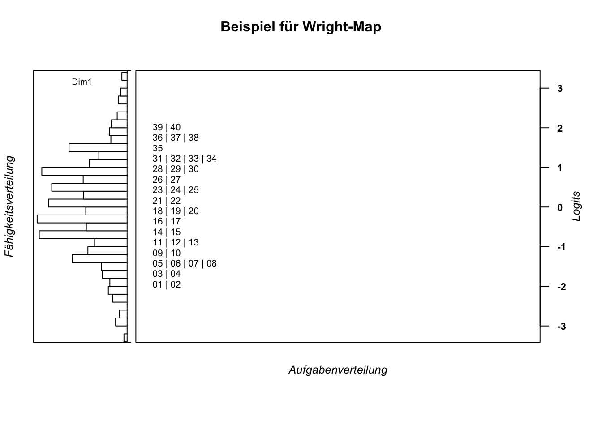

# Item Analyse
## Laden der benötigten Pakete und des Datensatzes


```r
library(TAM) # TAM-Paket
```

```
## Loading required package: CDM
```

```
## Loading required package: mvtnorm
```

```
## **********************************
## ** CDM 7.5-15 (2020-03-10 14:19:21)      
## ** Cognitive Diagnostic Models  **
## **********************************
```

```
## * TAM 3.5-19 (2020-05-05 22:45:39)
```

```r
library(WrightMap) # zur Erzeugung von Wright-Maps
library(RColorBrewer) # für schönere Farben in den Wright-Maps
data(data.sim.rasch) # data.sim.rasch: 2000 persons, 40 items
```

Das R-Paket "TAM" (Robitzsch, A., Kiefer, T., & Wu, M. (2019). TAM: Test Analysis Modules. R package version 3.3-10.
  https://CRAN.R-project.org/package=TAM) ist freie Software unter der Lizenz GNU *General Public License*.
  
## Modellschätzung


Der Befehl erzeugt ein Listen-Objekt mit vielen Einträgen. Folgend wird ein Dataframe-Objekt aus dieser Liste ausgewählt und ausgegeben. Es enthält verschiedene Spalten mit deskriptiven Kennwerten:


```r
mod1PL$item
```

```
##     item    N      M    xsi.item  AXsi_.Cat1 B.Cat1.Dim1
## I1    I1 2000 0.8270 -1.95906755 -1.95906755           1
## I2    I2 2000 0.8145 -1.85707784 -1.85707784           1
## I3    I3 2000 0.8000 -1.74448741 -1.74448741           1
## I4    I4 2000 0.7860 -1.64079925 -1.64079925           1
## I5    I5 2000 0.7725 -1.54485365 -1.54485365           1
## I6    I6 2000 0.7710 -1.53441512 -1.53441512           1
## I7    I7 2000 0.7430 -1.34668186 -1.34668186           1
## I8    I8 2000 0.7435 -1.34992594 -1.34992594           1
## I9    I9 2000 0.7295 -1.26040238 -1.26040238           1
## I10  I10 2000 0.6945 -1.04694135 -1.04694135           1
## I11  I11 2000 0.6905 -1.02335166 -1.02335166           1
## I12  I12 2000 0.6615 -0.85638275 -0.85638275           1
## I13  I13 2000 0.6515 -0.80026553 -0.80026553           1
## I14  I14 2000 0.6415 -0.74479292 -0.74479292           1
## I15  I15 2000 0.6000 -0.52027584 -0.52027584           1
## I16  I16 2000 0.5765 -0.39628492 -0.39628492           1
## I17  I17 2000 0.5720 -0.37273730 -0.37273730           1
## I18  I18 2000 0.5445 -0.22987456 -0.22987456           1
## I19  I19 2000 0.5205 -0.10621935 -0.10621935           1
## I20  I20 2000 0.5100 -0.05228424 -0.05228424           1
## I21  I21 2000 0.4925  0.03753652  0.03753652           1
## I22  I22 2000 0.4795  0.10429854  0.10429854           1
## I23  I23 2000 0.4350  0.33421807  0.33421807           1
## I24  I24 2000 0.4180  0.42310019  0.42310019           1
## I25  I25 2000 0.3995  0.52082702  0.52082702           1
## I26  I26 2000 0.3770  0.64147566  0.64147566           1
## I27  I27 2000 0.3765  0.64418273  0.64418273           1
## I28  I28 2000 0.3395  0.84834994  0.84834994           1
## I29  I29 2000 0.3235  0.93942118  0.93942118           1
## I30  I30 2000 0.3100  1.01785330  1.01785330           1
## I31  I31 2000 0.2935  1.11597708  1.11597708           1
## I32  I32 2000 0.2900  1.13714364  1.13714364           1
## I33  I33 2000 0.2620  1.31159123  1.31159123           1
## I34  I34 2000 0.2615  1.31479716  1.31479716           1
## I35  I35 2000 0.2255  1.55581073  1.55581073           1
## I36  I36 2000 0.2165  1.61968818  1.61968818           1
## I37  I37 2000 0.2050  1.70383560  1.70383560           1
## I38  I38 2000 0.1990  1.74896980  1.74896980           1
## I39  I39 2000 0.1755  1.93517136  1.93517136           1
## I40  I40 2000 0.1620  2.05013862  2.05013862           1
```

- *N*: Anzahl an Personen, die das jeweilige Item bearbeitet haben.

- *M*: Deskriptive Schwierigkeit des Items ($M = \frac{N_{korrekt}}{N_{gelöst}}$).

- *xsi.item*: *xsi* wird ausgesprochen wie geschrieben und bezieht sich auf den griechischen Buchstaben. Der $\xi$-Parameter ist die, mit dem Modell geschätzte, Aufgabenschwierigkeit auf der Skala von $-\infty$ bis $\infty$ mit 0 als Mittelwert. Übliche Werte in der Praxis liegen zwischen -3 bis 3. Eine Aufgabe mit Schwierigkeit $\xi=1$ ist dabei schwerer als eine Aufgabe mit Schwierigkeit $\xi=0$. Oft findet man den Schwierigkeitsparameter auch unter anderen griechischen Buchstaben in der Literatur, z. B. $\delta$ oder $\beta$. TAM übernimmt die Notation mit $\beta$ unter der Bezeichnung *IRT parametrization*. Siehe dazu den folgenden Output.


```r
mod1PL$item_irt
```

```
##    item alpha        beta
## 1    I1     1 -1.95906755
## 2    I2     1 -1.85707784
## 3    I3     1 -1.74448741
## 4    I4     1 -1.64079925
## 5    I5     1 -1.54485365
## 6    I6     1 -1.53441512
## 7    I7     1 -1.34668186
## 8    I8     1 -1.34992594
## 9    I9     1 -1.26040238
## 10  I10     1 -1.04694135
## 11  I11     1 -1.02335166
## 12  I12     1 -0.85638275
## 13  I13     1 -0.80026553
## 14  I14     1 -0.74479292
## 15  I15     1 -0.52027584
## 16  I16     1 -0.39628492
## 17  I17     1 -0.37273730
## 18  I18     1 -0.22987456
## 19  I19     1 -0.10621935
## 20  I20     1 -0.05228424
## 21  I21     1  0.03753652
## 22  I22     1  0.10429854
## 23  I23     1  0.33421807
## 24  I24     1  0.42310019
## 25  I25     1  0.52082702
## 26  I26     1  0.64147566
## 27  I27     1  0.64418273
## 28  I28     1  0.84834994
## 29  I29     1  0.93942118
## 30  I30     1  1.01785330
## 31  I31     1  1.11597708
## 32  I32     1  1.13714364
## 33  I33     1  1.31159123
## 34  I34     1  1.31479716
## 35  I35     1  1.55581073
## 36  I36     1  1.61968818
## 37  I37     1  1.70383560
## 38  I38     1  1.74896980
## 39  I39     1  1.93517136
## 40  I40     1  2.05013862
```


- *AXsi_.Cat1*: Schwierigkeit, gegeben, dass das Item verschiedenen Personengruppen und/oder Testheften zugeordnet wurde und unter den jeweiligen Bedingungen unterschiedlich erfolgreich bearbeitet wurde. Da hier nur ein eindimensionales Modell ohne weitere Bedingungen berechnet wurde, entspricht der Wert dem $\xi$-Parameter.

- *B.Cat1.Dim1*: Steigungsparameter. Im eindimensionalen 1-PL-Modell wird der B-Parameter nicht berechnet, sondern auf $B=1$ fixiert. Oft findet man den Steigungsparameter auch unter der Bezeichnung $\alpha$ (siehe Output oben zu *xsi.item*).

## Erzeugen einer Wright-Map


```r
thetas_1pl <- tam.wle(mod1PL) # WLEs berechnen
```

```
## Iteration in WLE/MLE estimation  1   | Maximal change  0.8281 
## Iteration in WLE/MLE estimation  2   | Maximal change  0.4335 
## Iteration in WLE/MLE estimation  3   | Maximal change  0.0883 
## Iteration in WLE/MLE estimation  4   | Maximal change  7e-04 
## Iteration in WLE/MLE estimation  5   | Maximal change  0 
## ----
##  WLE Reliability= 0.894
```

```r
item_xsis_1pl <- mod1PL$xsi$xsi # Itemschwierigkeiten separieren

wrightMap(thetas_1pl$theta, item_xsis_1pl, 
          item.side = itemClassic,
          main.title = "Beispiel für Wright-Map",
          axis.persons = "Fähigkeitsverteilung",
          axis.items = "Aufgabenverteilung")
```



```
##              [,1]
##  [1,] -1.95901708
##  [2,] -1.85702665
##  [3,] -1.74443543
##  [4,] -1.64074652
##  [5,] -1.54480023
##  [6,] -1.53436162
##  [7,] -1.34662700
##  [8,] -1.34987110
##  [9,] -1.26034689
## [10,] -1.04688427
## [11,] -1.02329441
## [12,] -0.85632426
## [13,] -0.80020663
## [14,] -0.74473359
## [15,] -0.52021484
## [16,] -0.39622299
## [17,] -0.37267520
## [18,] -0.22981140
## [19,] -0.10615527
## [20,] -0.05221976
## [21,]  0.03760166
## [22,]  0.10436417
## [23,]  0.33428538
## [24,]  0.42316815
## [25,]  0.52089569
## [26,]  0.64154518
## [27,]  0.64425227
## [28,]  0.84842093
## [29,]  0.93949280
## [30,]  1.01792547
## [31,]  1.11604992
## [32,]  1.13721663
## [33,]  1.31166540
## [34,]  1.31487135
## [35,]  1.55588652
## [36,]  1.61976438
## [37,]  1.70391234
## [38,]  1.74904684
## [39,]  1.93524957
## [40,]  2.05021754
```


