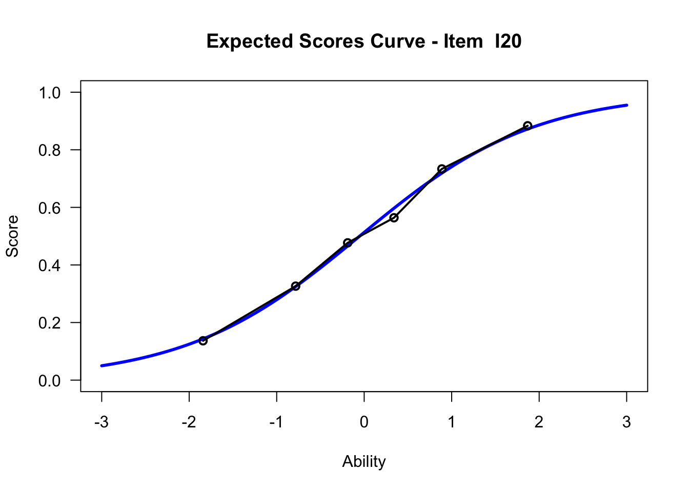
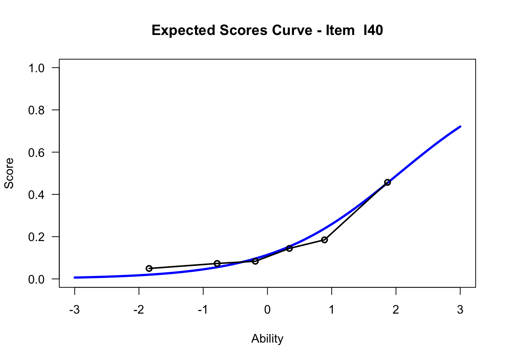

## ICC (Item Characteristic Curve)

### Input
           
Item Characteristic Curves (kurz: ICC) geben die Lösungswahrscheinlichkeit als Funktion der Fähigkeit der Probanden an. Dabei stellt die y-Achse die Lösungswahrscheinlichkeit und x-Achse die Probandenfähigkeit dar.

### R-Befehl für Generierung der ICC in TAM

Das Ausführen der folgenden Funktion führt zur Erstellung der ICC für Item 20 sowie der Anteile richtiger Lösungen von sechs Personenfähigkeitsgruppen zu dieser Aufgabe. Wie im folgenden erläutert, lässt sich damit untersuchen, inwiefern die Modellvorhersage (Rasch-Modell mit den auf Basis des Antwortverhaltens geschätzten Schwierigkeits- und Fähigkeitsparametern) und die Daten (tatsächliches Antwortverhalten) voneinander abweichen.


```r
plot(mod1, items = 20, ngroups = 6, export = FALSE) # export = FALSE verhindert separates Abspeichern der .png-Datei
```

```
## Iteration in WLE/MLE estimation  1   | Maximal change  0.8281 
## Iteration in WLE/MLE estimation  2   | Maximal change  0.4335 
## Iteration in WLE/MLE estimation  3   | Maximal change  0.0883 
## Iteration in WLE/MLE estimation  4   | Maximal change  7e-04 
## Iteration in WLE/MLE estimation  5   | Maximal change  0 
## ----
##  WLE Reliability= 0.894
```



Eine ICC kann alleine unter Kenntnis des Schwierigkeitsparameters der Aufgabe erstellt werden. Sie lässt sich nutzen, um grafisch zu beurteilen, inwiefern das tatsächliche Lösungsverhalten der Probanden von dem Verhalten, welches mithilfe des Rasch-Modells vorhergesagt wird, abweicht.

Naiv würde man davon ausgehen, dass man nur die tatsächlichen Lösungswahrscheinlichkeiten in Abhängigkeit von den Fähigkeiten der Probanden eintragen müsste (so macht man es auch bspw. im Physikunterricht, bei der ersten grafischen linearen Regression). Diese Lösungswahrscheinlichkeiten sind aber nicht für einzelne Probanden, sondern nur für Gruppen, direkt beobachtbar. Aufgrunddessen werden die Probanden in Fähigkeitsgruppen eingeteilt (Binning). Der Prozentsatz einer bestimmten Gruppe, der die Aufgabe richtig gelöst hat, entspricht dann der Lösungswahrscheinlichkeit.

Die Angaben MLE (Maximum Likelihood Estimates) und WLE (Weighted Likelihood Estimates) in der Ausgabe stehen für das angewandte Verfahren zur Schätzung der Personenfähigkeiten. Bei den durch die MLE geschätzten Personenfähigkeiten kommt es jedoch zu Verzerrungen, sodass auf den WLE zurückgegriffen wird (Trendtel, Pham, Yanagida, 2016, p. 202).


### Interpretation ICC im Rasch-Modell (s. Wu et al. 2016)

Ausführungen beziehen sich auf Item 20, s. obigen Plot

<b>blaue Kurve</b>: Modellkurve (vom Modell vorhergesagter Zusammenhang zw. Fähigkeit und Lösungswahrscheinlichkeit) --> Probanden mit einer Fähigkeitsausprägung von 1, lösen das Item mit 75%iger Wahrscheinlichkeit richtig

<b>schwarze Kurve</b>: empirische Kurve (beobachtete Lösungswahrscheinlichkeit bzw. Lösungsquote) --> etwa 76 % der Probanden mit der Fähigkeitsausprägung (ability) = 1 lösten das Item richtig

--> Bei diesem Beispiel (Item 20) liegt eine gute Passung beider Kurven vor, d.h. das Modell beschreibt das Lösungsverhalten bei diesem Item sehr gut.

#### Misfits

Für die Beurteilung von Items, kann die Passung der empirischen Kurve zur Modellkurve herangezogen werden. Dabei muss nicht immer die empirische Kurve gut zur Modellkurve passen --> Misfits

Es wird dabei zw. Overfit und Underfit unterschieden, wobei der wMNSQ-Wert (= standardized weighted mean square), welcher auch als Infit-Wert geführt wird, bei der Beurteilung eine Orientierung bieten kann "Die Infit-Statistik ist der mit den Varianzen [...] gewichtete Mittelwert, sodass Personen mit einer Fähigkeit näher bei der Itemschwierigkeit des betrachteten Items ein höheres Gewicht bekommen als Personen, deren Fähigkeit weiter weg liegt." (Trendtel, Pham, Yanagida, 2016, p. 209). Dabei sei darauf hingewiesen, dass trotz guter wMNSQ-Werte (Werte um 1), die Passung zwischen empirischer Kurve und Modellkurve als schlecht beurteilt werden kann. "Fit mean-square statistic is testing whether the slope of the observed ICC is the same as the theoretical ICC” (Wu et al., 2016, p. 145).

<b>Overfit</b>: wMNSQ-Wert (Infit) < 1; empirische Kurve steiler als Modellkurve; entspricht hoher discrimination --> item unterscheidet Probanden verschiedener Fähigkeitsausprägungen besser als andere Items im Test

<b>Underfit</b>: wMNSQ-Wert (Infit) > 1; empirische Kurve steiler als Modellkurve; entspricht geringerer discrimination

Es wird empfohlen, Items mit einem Overfit zu behalten und Items mit einem Underfit aus dem Test zu entfernen (s. Wu et al. 2016 p. 153).


### Gegenüberstellung leichtes - schweres Item


```r
mod1$xsi # Itemschwierigkeiten xsi aller Items
```

```
##             xsi     se.xsi
## I1  -1.95901708 0.06465854
## I2  -1.85702665 0.06311470
## I3  -1.74443543 0.06153710
## I4  -1.64074652 0.06019663
## I5  -1.54480023 0.05904820
## I6  -1.53436162 0.05892844
## I7  -1.34662700 0.05694173
## I8  -1.34987110 0.05697344
## I9  -1.26034689 0.05613124
## I10 -1.04688427 0.05438831
## I11 -1.02329441 0.05421784
## I12 -0.85632426 0.05313222
## I13 -0.80020663 0.05281391
## I14 -0.74473359 0.05252176
## I15 -0.52021484 0.05156219
## I16 -0.39622299 0.05118169
## I17 -0.37267520 0.05112121
## I18 -0.22981140 0.05083401
## I19 -0.10615527 0.05069507
## I20 -0.05221976 0.05066614
## I21  0.03760166 0.05066059
## I22  0.10436417 0.05069098
## I23  0.33428538 0.05102212
## I24  0.42316815 0.05124518
## I25  0.52089569 0.05155264
## I26  0.64154518 0.05202355
## I27  0.64425227 0.05203529
## I28  0.84842093 0.05307253
## I29  0.93949280 0.05363422
## I30  1.01792547 0.05416852
## I31  1.11604992 0.05490459
## I32  1.13721663 0.05507343
## I33  1.31166540 0.05660515
## I34  1.31487135 0.05663570
## I35  1.55588652 0.05919171
## I36  1.61976438 0.05995850
## I37  1.70391234 0.06102867
## I38  1.74904684 0.06163154
## I39  1.93524957 0.06434122
## I40  2.05021754 0.06620206
```

<b>Item 1</b>


```r
plot(mod1, items = 1, ngroups = 6, export = FALSE) # xsi = -1.96
```

```
## Iteration in WLE/MLE estimation  1   | Maximal change  0.8281 
## Iteration in WLE/MLE estimation  2   | Maximal change  0.4335 
## Iteration in WLE/MLE estimation  3   | Maximal change  0.0883 
## Iteration in WLE/MLE estimation  4   | Maximal change  7e-04 
## Iteration in WLE/MLE estimation  5   | Maximal change  0 
## ----
##  WLE Reliability= 0.894
```


<b>Item 40</b>


```r
plot(mod1, items = 40, ngroups = 6, export = FALSE) # xsi = 2.05
```

```
## Iteration in WLE/MLE estimation  1   | Maximal change  0.8281 
## Iteration in WLE/MLE estimation  2   | Maximal change  0.4335 
## Iteration in WLE/MLE estimation  3   | Maximal change  0.0883 
## Iteration in WLE/MLE estimation  4   | Maximal change  7e-04 
## Iteration in WLE/MLE estimation  5   | Maximal change  0 
## ----
##  WLE Reliability= 0.894
```


#### Interpretation

Probanden mit einer geschätzten Fähigkeit von 0 lösen diese beiden Items mit unterschiedlichen Lösungswahrscheinlichkeiten. Während Probanden mit einer Fähigkeitsausprägung von 0 das Item 1 mit etwa 90%iger Wahrscheinlichkeit richtig lösen, lösen diese das Item 40 mit einer etwa 15%igen Lösungswahrscheinlichkeit.

### Gegenüberstellung ICC Rasch - 2PL

<b>Item 40 Rasch</b>


```r
plot(mod1, items = 40, ngroups = 6, export = FALSE) # Steigungsparameter = 1
```

```
## Iteration in WLE/MLE estimation  1   | Maximal change  0.8281 
## Iteration in WLE/MLE estimation  2   | Maximal change  0.4335 
## Iteration in WLE/MLE estimation  3   | Maximal change  0.0883 
## Iteration in WLE/MLE estimation  4   | Maximal change  7e-04 
## Iteration in WLE/MLE estimation  5   | Maximal change  0 
## ----
##  WLE Reliability= 0.894
```



<b>Item 40 2PL</b>

```r
plot(mod2, items = 40, ngroups = 6, export = FALSE) # Steigungsparameter frei geschätzt
```

```
## Iteration in WLE/MLE estimation  1   | Maximal change  0.3445 
## Iteration in WLE/MLE estimation  2   | Maximal change  0.0677 
## Iteration in WLE/MLE estimation  3   | Maximal change  5e-04 
## Iteration in WLE/MLE estimation  4   | Maximal change  0 
## ----
##  WLE Reliability= 0.894
```


#### Deutung

Beim 2PL Modell wird der Steigungsparameter für jedes Item frei geschätzt. Das zeigt sich unter anderem in den ICCs. Durch das Vorliegen des simulierten Datensatzes zeigt sich kein merkbarer Unterschied in den ICCs des Rasch und 2PL Modells. Dennoch sei an dieser Stelle angemerkt, dass es beim 2PL Modell durchaus zu ICCs kommen kann, die negative Steigungsparameter aufweisen. Die Interpretation dahinter wäre: Bei steigender Probandenfähigkeit, sinkt die Lösungswahrscheinlichkeit des Items. Dies kann ein Indiz für ein nicht funktionierendes Item sein, aber ebenso ein Hinweis auf eine Mehrdimensionalität des Konstruktes (Bühner, 2011, p.506; Chalmers, 2015, p. 216). Jenes Item könnte demnach in eine andere Dimension fallen.
