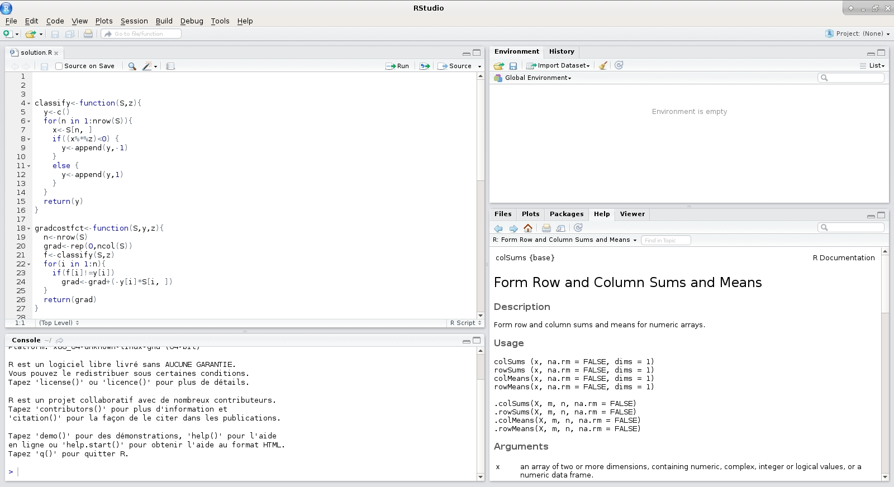

# Basiswissen für R: Praxisguide
*Autoren: Daniel Rehfeldt, Martin Brämer*

## Motivation

Herzlich Willkommen zum Beitrag *Basiswissen für R*. Viele Einführungswerke oder -kurse für das open-source-Statistikprogramm R sind auf ein heterogenes Publikum ausgerichtet und beginnen daher mit Operationen wie Addition von Zahlen und Vektoren oder dem Konstruieren eigener, fiktiver Datensätze. Wir möchten mit diesem Beitrag einen anderen Weg gehen und direkt zielgruppenorientiert eine Einführung für Datenhandling in R aus Perspektiver der quantitativen, empirischen Bildungsforschung liefern.

## Inhalte
Der Praxisguide startet mit einer knappen Einführung in die Objekttypen in R mit Fokus auf 

- Funktionen und Pakete (Pakete), die den *Werkzeugkasten*"* R ausmachen.
- Datensätzen (wie sie aus quantitativen Erhebungen resultieren), 
- Variablen (z. B. resultierend aus Fragebogen-Fragen resultierend), sowie 

Nach Klärung dieses Grundwissens werden handlungsnahe, praktische Tipps zum Coden in R gegeben, damit bereits von Beginn an eine gewisse Stringenz und Sauberkeit erlernt wird, die z. B. ein späteres Referenzieren und Nachschlagen, sowie die Weitergabe von z. B. Code-Chunks erleichtert.
Abgeschlossen wird diese kleine Einführung mit einer Anleitung zur Bildung von Teil-Datensätzen, die in sehr vielen Funktionen von R benötigt werden bzw. den Umgang mit den Daten wesentlich erleichtern. Für fortgeschrittene Techniken sei auf unseren zweiten Beitrag zum Thema Datenaufbereitung (auch in dieser Reihe) verwiesen.
Deutlich ausführlichere Einführungen in R finden sich z. B. [hier](https://data-flair.training/blogs/r-tutorial/) oder grundsätzlich über die Web-Recherche einzelner Fragestellungen.
Außerdem empfehlen wir, regen Gebrauch von der Kommentarfunktion in R zu machen (*auskommentieren*). Jede Zeile mit einer vorangestellten Raute (#) interpretiert R nicht als Code. Sollen mehrere bereits geschriebene Zeilen nachträglich als Kommentar definiert werden, kann so vorgegangen werden: 

1. Text markieren, 
2. `STRG + UMSCH + C` drücken.

Genauso kann auch *ent-kommentiert* werden.
Den Lesenden sollte zudem bewusst sein, dass R mittlerweile eine derart umfangreiche Paketauswahl unterstützt, dass für jedes (Datenbereinigungs-)Problem mehrere Lösungen existieren, von denen wir hier nur wenige vorstellen.

## RStudio
Für ein deutlich übersichtlicheres Coden und Arbeiten empfehlen wir die Benutzung der Oberfläche [RStudio:](https://rstudio.com/):

<div class="figure" style="text-align: center">

<p class="caption">(\#fig:rstudio)RStudio im Vergleich zu Basis-R (oben:  von xmodulo, lizensiert unter CC BY 2.0. https://creativecommons.org/licenses/by/2.0/?ref=openverse, unten: von Daniel Rehfeldt</p>
</div>

Der Installationsprozess gestaltet sich folgendermaßen:

1. Installieren der Software R selbst: [Link](https://www.r-project.org/)
2. Installieren von [RStudio:](https://rstudio.com/)

Rstudio bietet gegenüber basalem R so viele Vorteile, dass seine Nutzung obligatorisch geworden ist:

1. Zusammengehöriger Code wird bereits beim Schreiben durch *Highlighting* und Farbgebung ausgezeichnet
2. RStudio bietet mehrere Fenster, die unterschiedliche Funktionen erfüllen (Coden, Objekte, Output, Grafiken usw.)
3. Autovervollständigung von Funktions- oder Objektnamen (ähnlich wie z. B. Excel)
4. erleichterte Paketverwaltung
5. Erleichterte Bedienung über z. B. View-Tab (vgl. Kapitel "Datenaufbereitung"), direktes Betrachten von Datensätzen usw. im `Environment`-Fenster
6. Speichern des R-Scripts, `run` und `re-run` des Codes direkt
7. Integrierte Hilfefunktion (u. a. `Cheatsheets` zum Spicken unter `help – cheatsheets`)

## Pakete

R bietet bereits in der Standard-installierten Version sehr viele Funktionen, um Daten manipulieren zu können.
Um einige zusätzliche Funktionen nutzen zu können, werden zunächst Pakete in R installiert und geladen. Pakete sind Container für Funktionen und Datensätze, die meist eine gewisse Analyserichtung teilen, etwa das `psych()`-Paket für psychometrische Analysen.
Informationen zu einzelnen Paketen finden sich über eine einfache Web-Suche.
Das Nutzen von Paketen wird über zwei Schritte realisiert.

(1) Den ersten und nur einmalig durchzuführenden Schritt bildet das Installieren das Pakets (`install.package()`) – ähnlich, wie ein Programm am PC nur einmalig installiert werden muss. 
(2) Zweiter Schritt ist dass das Aktivieren bzw. Laden des Pakets (`library()`) – vergleichbar mit dem Starten eines Programms am PC. Ebenso analog dazu muss nach jedem Neustart von RStudio auch das Paket neu geladen werden.


```r
# Installiere und lade die benötigten Pakete
# install.Pakete("xlsx") # da dieses Paket bereits zuvor vom Autor installiert wurde, muss es hier nicht erneut installiert werden und ist daher auskommentiert
# install.Pakete("psych") # da dieses Paket bereits zuvor vom Autor installiert wurde, muss es hier nicht erneut installiert werden und ist daher auskommentiert
library(psych) # liefert psychometrisch nützliche Funktionen
library(xlsx) # hilft beim Import von Excel-Daten
```


## Objekte in R
### Datensätze: Typen
#### Dataframe
Die meisten Datensätze in R sind Dataframes. Sie bestehen im Wesentlichen, ähnlich wie eine Excel-Tabelle, aus Zeilen und Spalten. Die Zeilen sind in der Regel nummeriert und können z. B. Personen entsprechen, die Spalten tragen je einen Namen und stellen je meist eine Variable dar. Im folgenden Beispiel hat Person 2 in der Variablen `Motivation` eine Ausprägung von 2 und ist männlich.


```r
demodata 
```

```
##      pcode motivation geschlecht
## 1 Person 1          3   weiblich
## 2 Person 2          2   männlich
## 3 Person 3          2     divers
## 4 Person 4          4   weiblich
## 5 Person 5          6   männlich
## 6 Person 6          1     divers
## 7 Person 7          4   männlich
```
Der Datensatz-Name kann frei gewählt und auch verändert werden. Es hat sich bewährt, aussagekräftige Namen statt Kürzel wie `df` o. Ä. zu verwenden. Dies erleichtert die Orientierung bei multiplen Datensätzen.


```r
# Ändere den Datensatznamen (genauer: Erzeuge neuen Datensatz, der ein inhaltliches Duplikat ist):

demodata_name_anders <- demodata
```

Für große Datensätze kann mit der `head()`-Funktion der Output auf die ersten 6 Zeilen beschränkt werden:

```r
head(demodata_name_anders)
```

```
##      pcode motivation geschlecht
## 1 Person 1          3   weiblich
## 2 Person 2          2   männlich
## 3 Person 3          2     divers
## 4 Person 4          4   weiblich
## 5 Person 5          6   männlich
## 6 Person 6          1     divers
```

### Matrix
Eine Matrix ist wie eine *abgespeckte* Version eines Dataframes. Sie kann nur Zahlen enthalten und hat keine spezielle Benennung der Zeilen oder Spalten: 


```r
print(A) 
```

```
##      [,1] [,2] [,3]
## [1,]    2    3    2
## [2,]    1    5    6
```

### Listen
Listen sind sehr variable *Container*. Sie können nahezu alles beinhalten, wie z.B. Dataframes, Matrizen, einzelne Variablen usw., auch verschiedene Objekttypen in derselben Liste. Mit mehreren Dataframes in einer Liste können z. B. Routineaufgaben der Datenbereinigung auf multiple Datensätze gleichzeitig angewandt werden.[^1].

[^1]: Man nutzt dafür die Blaupause `lapply(LISTE,`   `function(x){MANIPULATION_von_x`  
`return(x)}) # x ist hier je ein Datensatz der Liste`


```r
# Erstelle zwei Datensätze und forme daraus eine Liste mit zwei enthaltenen Datensätzen
demodata <-
  data.frame(
    pcode = c("Person 1", "Person 2", "Person 3"),
    motivation = c(3, 2, 2),
    geschlecht = c("weiblich", "männlich", "divers")
  )
demodata2 <-
  data.frame(
    pcode = c("Person 4", "Person 5", "Person 6"),
    motivation = c(4, 1, 2),
    geschlecht = c("weiblich", "weiblich", "männlich")
  )
demodata
```

```
##      pcode motivation geschlecht
## 1 Person 1          3   weiblich
## 2 Person 2          2   männlich
## 3 Person 3          2     divers
```

```r
demodata2
```

```
##      pcode motivation geschlecht
## 1 Person 4          4   weiblich
## 2 Person 5          1   weiblich
## 3 Person 6          2   männlich
```

```r
liste <- list(demodata, demodata2)
liste
```

```
## [[1]]
##      pcode motivation geschlecht
## 1 Person 1          3   weiblich
## 2 Person 2          2   männlich
## 3 Person 3          2     divers
## 
## [[2]]
##      pcode motivation geschlecht
## 1 Person 4          4   weiblich
## 2 Person 5          1   weiblich
## 3 Person 6          2   männlich
```

## Variablen: Typen
Um Variablen – egal welchen Typs – in einem Dataframe auszuwählen, kann der `$-Operator` nach der Formel `DATASETNAME$VARIABLENNAME` verwendet werden.

### Numeric
Eine Variable vom Typ Numeric besteht innerhalb eines Dataframes aus einer *Spalte von Zahlen*:


```r
# Variable in einem Dataframe
demodata <-
  data.frame(
    motivation = c(3, 2, 2),
    geschlecht = c("weiblich", "weiblich", "divers")
  )
demodata$motivation 
```

```
## [1] 3 2 2
```

### Character
Eine Character-Variable haben wir bereits im oberen Beispiel kennengelernt, sie besteht aus einer *Spalte von Textelementen*:


```r
demodata$geschlecht
```

```
## [1] "weiblich" "weiblich" "divers"
```

### Factor
Einen Kompromiss zwischen Numeric und Character stellt der Variablentyp *Factor* dar. Hier werden bei einer eigentlich numerischen Variablen den Zahlen Text zugeordnet. Zudem besitzt eine Factor-Variable eine definierte Auswahl an *Levels*, d. h. es gibt eine endliche Anzahl an definierten Kategorien einer Factor-Variablen, andere Kategorien sind unzulässig und müssten erst erstellt werden. In diesem Beispiel erzeugen wir zunächst eine Factor-Variable[^2]:

[^2]: Bei realen Daten ist diese Eigenschaft manchmal durch den Import "gegeben". R interpretiert z. B. Variablen mit nur "männlich" und "weiblich" als Faktor.


```r
demodata <- data.frame(motivation = c(3, 2, 2), geschlecht = c(1, 2, 3))
demodata$geschlecht <-
  factor(
    demodata$geschlecht,
    levels = c(1, 2, 3), # Dies sind die Zahlenwerte
    labels = c("weiblich", "männlich", "divers") # Dies sind die zugeordneten Texte.
    #Die Reihenfolge ist entscheidend für die Zuordnung
  )
```


```r
demodata$geschlecht
```

```
## [1] weiblich männlich divers  
## Levels: weiblich männlich divers
```


## Coden: Tipps & Tricks
Vorweg sei auf eine für Anfänger\*innen, aber auch Fortgeschrittene **unerlässliche Hilfe** hingewiesen: Eine einfache Websuche des jeweiligen Problems. Durch die gewaltige R-User-Community liefern Websites wie [Stack Overflow](https://stackoverflow.com/) in fast allen Fällen konkrete und sofortige Hilfe – und dies meist deutlich verständlicher als die Standard R-Hilfe.


### Umgang mit Klammern
Wie viele Programmiersprachen arbeitet auch R mit Klammern. Betrachtet man den Typus der Klammer, kann man hieraus häufig deren Funktion herleiten und gewinnt so an Orientierung. 
Dafür ein paar Beispiele:

**Runde Klammern** deuten meist auf Funktionen hin, das Argument (das, worauf die Funktion angewandt wird) steht in der Klammer:


```r
summary(demodata) # liefert einen Überblick (Funktion summary() ) über die Daten des Dataframes demodata (das Argument)
```

**Eckige Klammern** kommen z. B. bei der Auswahl von Teil-Daten(sätzen) zum Einsatz (vgl. Abschnitt \@ref(teil-datensaetze)):


```r
demodata[1,2] #liefert den Eintrag in der ersten Zeile und zweiten Spalte des Dataframes
```

```
## [1] weiblich
## Levels: weiblich männlich divers
```

**Geschweifte Klammern** werden z. B. für Wenn-Dann-Beziehungen, Schleifen und selbst kreierte Funktionen gebraucht. Findet man diese vor (z. B. bei der Online-Recherche), handelt es sich also meist um einen solchen Fall. Ein kleines Beispiel für eine Schleife folgt nach einer kurzen Einführung:

### Schleifen
Für Einsteiger\*innen in R können Schleifen herausfordernd sein, daher fassen wir uns hier kurz. Viele gewünschte Operationen sind auch ohne Schleifen möglich, Schleifen können allerdings gerade bei großen Datensätzen eine enorme Zeitersparnis bedeuten.

Der Datensatz für das Beispiel ist im [GitHub-Verzeichnis](https://github.com/dbuschhue/P4-Worflow/blob/master/data_for_chapters/baseknowledge_R/df_unrein_1_neu.rds) dieser Publikation verfügbar.

Ein Beispiel zu Schleifen: Für die *Fach im Abitur gehabt ja/nein*-Variablen erhalten wir einen Datensatz, der 1 für *ja* und `NA` für *nein* enthält. Wir möchten gern eine 0 statt `NA`:


```r
# Betrachte beispielhaft die ersten beiden Abitur-Variablen

# Finde die Spaltennummer der Abitur-Variablen über die Funktion names():

names(demodata)
```

```
##  [1] "pcode"                  "VW.theo"                "VW.prax"               
##  [4] "VW.plan"                "VW.durch"               "VW.reflex"             
##  [7] "Abitur_Fach_Biologie"   "Abitur_Fach_Chemie"     "Abitur_Fach_Geographie"
## [10] "Abitur_Fach_Geschichte" "Abitur_Fach_Informatik" "Abitur_Fach_Physik"    
## [13] "Abitur_Fach_PW"         "geschlecht"             "alter"                 
## [16] "semester.pre"           "abi"                    "dozent"
```

```r
# Die Abitur-Variablen beginnen also ab Spalte 7.

# Betrachte beispielhaft die ersten beiden solchen Variablen:
head(demodata[c(1:25), c(7, 8)]) 
```

```
##   Abitur_Fach_Biologie Abitur_Fach_Chemie
## 1                   NA                 NA
## 2                   NA                 NA
## 3                   NA                 NA
## 4                   NA                 NA
## 5                   NA                 NA
## 6                   NA                 NA
```

```r
#Variante ohne Schleife: Jede Variable einzeln:
demodata[is.na(demodata[, 7]) == T, 7] <- 0 #Diejenigen Personen,
# die in Variable 7 ein NA aufweisen,
# erhalten als Wert nun eine 0
demodata[is.na(demodata[, 8]) == T, 8] <- 0
# usw. bis Variable 13.

#Überprüfe:
head(demodata[c(1:25), c(7, 8)])
```

```
##   Abitur_Fach_Biologie Abitur_Fach_Chemie
## 1                    0                  0
## 2                    0                  0
## 3                    0                  0
## 4                    0                  0
## 5                    0                  0
## 6                    0                  0
```


Als Schleife sähe es – wohlgemerkt für alle Abitur-Variablen gleichzeitig (!) – wie folgt aus:


```r
for (i in 7:13) { # Abitur-Variablen stehen in den Spalten 7 bis 13
  demodata[is.na(demodata[, i]) == T, i] <- 0 # Wo NAs stehen, soll 0 gesetzt werden
}
head(demodata[c(1:25), c(7:13)]) # Überprüfe
```

```
##   Abitur_Fach_Biologie Abitur_Fach_Chemie Abitur_Fach_Geographie
## 1                    0                  0                      0
## 2                    0                  0                      0
## 3                    0                  0                      0
## 4                    0                  0                      0
## 5                    0                  0                      0
## 6                    0                  0                      0
##   Abitur_Fach_Geschichte Abitur_Fach_Informatik Abitur_Fach_Physik
## 1                      0                      0                  0
## 2                      0                      0                  0
## 3                      0                      0                  0
## 4                      0                      0                  0
## 5                      0                      0                  0
## 6                      0                      0                  0
##   Abitur_Fach_PW
## 1              0
## 2              0
## 3              0
## 4              0
## 5              0
## 6              0
```

Die `for()`-Schleife enthält hierbei immer zwei Klammer-Typen. Die runde Klammer umschließt die Laufzahl `i` und welche Werte sie durchläuft, die geschweifte Klammer umschließt die Operationen, die je Laufzahldurchgang erfolgen sollen.

### Eigene Funktionen
Da eigene Funktionen auch für Einsteiger\*innen eine hohe Komplexität aufweisen können, wird hier nur auf [diese Quelle](https://de.wikibooks.org/wiki/GNU_R:_Eigene_Funktionen_programmieren) verwiesen.

### Klammern in RStudio
Um die Übersicht über die Klammern zu erhalten, empfiehlt sich wie bereits erwähnt die Nutzung von [RStudio:](https://rstudio.com/), da hier:

1. Zusammengehörende Klammern hervorgehoben erscheinen
2. Das Öffnen einer Klammer stets von einer sofortig erscheinenden *Schließ-Klammer* begleitet wird.
3. Klammern auch gut nachträglich gesetzt werden können: 
    - Code z. B. mit der Maus markieren, 
    - Klammer eintippen, 
    - der Code erscheint automatisch in Klammern eingeschlossen
  
Dies veranschaulicht Abb. \@ref(fig:klammern-in-r).


<div class="figure" style="text-align: center">

<p class="caption">(\#fig:klammern-in-r)Klammern und visuelle Hilfen in RStudio</p>
</div>
  

## Übersichtlich Coden
Informatiker\*innen lernen bereits im Studium Grundsätze kennen, mit denen sich so übersichtlich Coden lässt, dass auch andere sich schnell in einem fremden Code zurechtfinden können. Glücklicherweise gibt es für die Anordnung von Code ein Tastenkürzel in R, das auch dabei hilft, selbst den Überblick zu behalten: 

1. Code markieren 
2. STRG + UMSCH + A`


```r
# vorher:
demodata$geschlecht<-factor(demodata$geschlecht,levels=c(1,2,3),labels=c("weiblich","männlich","divers"))
```


```r
# nachher:
demodata$geschlecht <-
  factor(
    demodata$geschlecht,
    levels = c(1, 2, 3),
    labels = c("weiblich", "männlich", "divers")
  ) 
```

### Schneller Coden: Shortcuts
RStudio beherrscht diverse Tastenkombinationen, die einem den Coding-Alltag erleichtern, hier unsere Favoriten:

- `[ALT] + [-]` erzeugt den *Zuweisepfeil* `<-`
- `[STRG] + [R]` oder `[STRG] + [ENTER]` führen den markierten Code aus (*run*).
- `[STRG] + [ALT] + [B]` führen den Code bis zur aktuellen Cursor-Position aus 

## Datensätze: Teil-Datensätze bilden {#teil-datensaetze}
Nun kommen wir zu einer für die Datenaufbereitung besonders wichtigen Fähigkeit in R – dem Bilden von Teil-Datensätzen.
Diese werden zum Beispiel gebraucht, wenn eine Aufbereitung oder Analyse nur bestimmte Zeilen (z. B. Personen) oder Spalten (z. B. Variablen) berücksichtigen soll. Eine universelle Formel für das Bilden von Teildatensätzen lautet:

`datensatz[Zeilenauswahl, Spaltenauswahl]`

Es gibt hierbei mehrere Wege, Zeilen und/oder Spalten auszuwählen, hier einige Beispiele:

**Weg 1**: Direkte Auswahl der Proband\*innen (Zeilen) und Variablen (Spalten) über ihre Nummer:


```r
demodata #zeigt gesamten Datensatz (zu groß, daher hier nicht dargestellt)
```


```r
demodata[1, 3] #wählt Person 1 und Variable 3 aus
```

```
## [1] 4
```

```r
# Person 1 hat also in der Variablen 3 die Ausprägung 4

demodata[c(1:3),] #wählt Personen 1, 2 und 3 in allen Variablen aus 
```

```
##        pcode VW.theo VW.prax VW.plan VW.durch VW.reflex Abitur_Fach_Biologie
## 1 01.01.2000       4       4       2        2         5                    0
## 2 01.04.1987       3       4       5        4         4                    0
## 3         06       3       3       4        4         4                    0
##   Abitur_Fach_Chemie Abitur_Fach_Geographie Abitur_Fach_Geschichte
## 1                  0                      0                      0
## 2                  0                      0                      0
## 3                  0                      0                      0
##   Abitur_Fach_Informatik Abitur_Fach_Physik Abitur_Fach_PW geschlecht alter
## 1                      0                  0              0          4    NA
## 2                      0                  0              0          4    NA
## 3                      0                  0              0          4    NA
##   semester.pre abi dozent
## 1           NA  NA Brämer
## 2           NA  NA Brämer
## 3           NA  NA Brämer
```


```r
# Folgendes wählt alle Personen, aber nur die Variablen 1, 2 und 3, aus 
# (entspricht ersten drei Spalten des Dataframes):
demodata[, c(1:3)] 
# Output wäre zu groß, daher mit head():
```


```r
head(demodata[, c(1:3)]) 
```

```
##                 pcode VW.theo VW.prax
## 1          01.01.2000       4       4
## 2          01.04.1987       3       4
## 3                  06       3       3
## 4    1.NA2.NA3.284.10       2       1
## 5              141651       5       5
## 6 141651BIEN105411138       3       4
```


```r
# Folgendes wählt alle Personen AUßER Person 1, 2 und 3 in allen Variablen aus.
demodata[-c(1:3),] 
# Output wäre zu groß, daher mit head():
```


```r
head(demodata[, -c(1:3)]) 
```

```
##   VW.plan VW.durch VW.reflex Abitur_Fach_Biologie Abitur_Fach_Chemie
## 1       2        2         5                    0                  0
## 2       5        4         4                    0                  0
## 3       4        4         4                    0                  0
## 4       1        1         2                    0                  0
## 5       4        4         5                    0                  0
## 6       4        4         4                    0                  0
##   Abitur_Fach_Geographie Abitur_Fach_Geschichte Abitur_Fach_Informatik
## 1                      0                      0                      0
## 2                      0                      0                      0
## 3                      0                      0                      0
## 4                      0                      0                      0
## 5                      0                      0                      0
## 6                      0                      0                      0
##   Abitur_Fach_Physik Abitur_Fach_PW geschlecht alter semester.pre abi dozent
## 1                  0              0          4    NA           NA  NA Brämer
## 2                  0              0          4    NA           NA  NA Brämer
## 3                  0              0          4    NA           NA  NA Brämer
## 4                  0              0          4    NA           NA  NA Brämer
## 5                  0              0          4    NA           NA  NA Brämer
## 6                  0              0          4    NA           NA  NA Brämer
```


**Weg 2**: Auswahl der Variablen über den Variablennamen:


```r
# Folgendes wählt die Variable "geschlecht" für alle Personen aus. 
# Die Anführungszeichen kommen immer dann zum Einsatz, 
# wenn Text als Argument genutzt wird. head() liefert nur die ersten 7 Zeilen.

head(demodata[, c("geschlecht")])
```

```
## [1] keine Angabe keine Angabe keine Angabe keine Angabe keine Angabe
## [6] keine Angabe
## Levels: weiblich männlich divers keine Angabe
```


**Weg 3**: Auswahl von Personen über Bedingungen:


```r
# Wählt alle weiblichen Personen und alle Variablen aus:
demodata[demodata$geschlecht == "weiblich", ]
```


```r
# Output wäre zu groß, daher mit head():
head(demodata[demodata$geschlecht == "weiblich", ])
```

```
##           pcode VW.theo VW.prax VW.plan VW.durch VW.reflex Abitur_Fach_Biologie
## 13     ALLY2570       4      99       3        3         3                    1
## 14     ALNA2397       2       2       4        3         3                    1
## 21   Anan1913         1       2       1        1         1                    1
## 23     ANDA2157       2       2       3        3         3                    1
## 27     ANER0110       2       3       2        2         2                    0
## 31     ANIA1696       2       3       2        5         3                    1
##    Abitur_Fach_Chemie Abitur_Fach_Geographie Abitur_Fach_Geschichte
## 13                  1                      1                      1
## 14                  0                      0                      1
## 21                  1                      1                      1
## 23                  1                      0                      1
## 27                  0                      0                      1
## 31                  0                      0                      1
##    Abitur_Fach_Informatik Abitur_Fach_Physik Abitur_Fach_PW geschlecht alter
## 13                      0                  0              1   weiblich     2
## 14                      0                  0              0   weiblich     6
## 21                      0                  0              0   weiblich     5
## 23                      0                  1              1   weiblich     7
## 27                      0                  0              1   weiblich    17
## 31                      0                  0              1   weiblich     5
##    semester.pre abi dozent
## 13            1 3.1 Brämer
## 14            1 2.7 Brämer
## 21            1 2.7 Brämer
## 23            1 3.1 Brämer
## 27            1 3.1 Brämer
## 31            1 2.7 Brämer
```


```r
#wählt nur Personen mit vollständigen Daten aus = Zeilen ohne "NA":
demodata[complete.cases(demodata),]
```


```r
# Output wäre zu groß, daher mit head():
head(demodata[complete.cases(demodata),])
```

```
##           pcode VW.theo VW.prax VW.plan VW.durch VW.reflex Abitur_Fach_Biologie
## 13     ALLY2570       4      99       3        3         3                    1
## 14     ALNA2397       2       2       4        3         3                    1
## 15     ALNA2754       1       2       1        1         1                    1
## 20     ANAN0770       4       5       6        6         4                    1
## 21   Anan1913         1       2       1        1         1                    1
## 23     ANDA2157       2       2       3        3         3                    1
##    Abitur_Fach_Chemie Abitur_Fach_Geographie Abitur_Fach_Geschichte
## 13                  1                      1                      1
## 14                  0                      0                      1
## 15                  0                      0                      1
## 20                  0                      1                      0
## 21                  1                      1                      1
## 23                  1                      0                      1
##    Abitur_Fach_Informatik Abitur_Fach_Physik Abitur_Fach_PW geschlecht alter
## 13                      0                  0              1   weiblich     2
## 14                      0                  0              0   weiblich     6
## 15                      0                  0              1     divers    16
## 20                      1                  0              0   männlich    13
## 21                      0                  0              0   weiblich     5
## 23                      0                  1              1   weiblich     7
##    semester.pre abi dozent
## 13            1 3.1 Brämer
## 14            1 2.7 Brämer
## 15            1 2.4 Brämer
## 20            1 3.5 Brämer
## 21            1 2.7 Brämer
## 23            1 3.1 Brämer
```


```r
# Folgendes wählt nur Personen aus, die in der Variablen "dozent" den Text "Brämer"
# enthalten. Dies geht allerdings nur, wenn die Variable vom Typ "Character" ist:
demodata[grepl("Brämer", demodata$dozent),] 
```


```r
# Output wäre zu groß, daher mit head():
head(demodata[grepl("Brämer", demodata$dozent),] )
```

```
##                 pcode VW.theo VW.prax VW.plan VW.durch VW.reflex
## 1          01.01.2000       4       4       2        2         5
## 2          01.04.1987       3       4       5        4         4
## 3                  06       3       3       4        4         4
## 4    1.NA2.NA3.284.10       2       1       1        1         2
## 5              141651       5       5       4        4         5
## 6 141651BIEN105411138       3       4       4        4         4
##   Abitur_Fach_Biologie Abitur_Fach_Chemie Abitur_Fach_Geographie
## 1                    0                  0                      0
## 2                    0                  0                      0
## 3                    0                  0                      0
## 4                    0                  0                      0
## 5                    0                  0                      0
## 6                    0                  0                      0
##   Abitur_Fach_Geschichte Abitur_Fach_Informatik Abitur_Fach_Physik
## 1                      0                      0                  0
## 2                      0                      0                  0
## 3                      0                      0                  0
## 4                      0                      0                  0
## 5                      0                      0                  0
## 6                      0                      0                  0
##   Abitur_Fach_PW   geschlecht alter semester.pre abi dozent
## 1              0 keine Angabe    NA           NA  NA Brämer
## 2              0 keine Angabe    NA           NA  NA Brämer
## 3              0 keine Angabe    NA           NA  NA Brämer
## 4              0 keine Angabe    NA           NA  NA Brämer
## 5              0 keine Angabe    NA           NA  NA Brämer
## 6              0 keine Angabe    NA           NA  NA Brämer
```


```r
#wählt Personen aus, die zwischen 17 und 19 Jahren alt sind:
demodata[demodata$alter %in% c(17:19), ] 
```

```
##        pcode VW.theo VW.prax VW.plan VW.durch VW.reflex Abitur_Fach_Biologie
## 27  ANER0110       2       3       2        2         2                    0
## 251 JANA2801       2       2       2        1         2                    1
## 271 KAER0824       1       1       1        3         1                    1
## 476 SONA1510       4       5       2        4         3                    0
##     Abitur_Fach_Chemie Abitur_Fach_Geographie Abitur_Fach_Geschichte
## 27                   0                      0                      1
## 251                  0                      1                      1
## 271                  0                      0                      0
## 476                  1                      0                      1
##     Abitur_Fach_Informatik Abitur_Fach_Physik Abitur_Fach_PW geschlecht alter
## 27                       0                  0              1   weiblich    17
## 251                      0                  0              0   weiblich    17
## 271                      0                  0              0   weiblich    17
## 476                      0                  0              1   weiblich    18
##     semester.pre abi dozent
## 27             1 3.1 Brämer
## 251            1 3.1 Brämer
## 271            1 2.7 Brämer
## 476            1 3.9 Brämer
```

Auch Funktionen können Teil-Datensätze erzeugen, wie beispielsweise `subset()`.


```r
subset(demodata,demodata$alter %in% c(17:19)) #wählt Personen aus, die zwischen 17 und 19 Jahren alt sind
```

```
##        pcode VW.theo VW.prax VW.plan VW.durch VW.reflex Abitur_Fach_Biologie
## 27  ANER0110       2       3       2        2         2                    0
## 251 JANA2801       2       2       2        1         2                    1
## 271 KAER0824       1       1       1        3         1                    1
## 476 SONA1510       4       5       2        4         3                    0
##     Abitur_Fach_Chemie Abitur_Fach_Geographie Abitur_Fach_Geschichte
## 27                   0                      0                      1
## 251                  0                      1                      1
## 271                  0                      0                      0
## 476                  1                      0                      1
##     Abitur_Fach_Informatik Abitur_Fach_Physik Abitur_Fach_PW geschlecht alter
## 27                       0                  0              1   weiblich    17
## 251                      0                  0              0   weiblich    17
## 271                      0                  0              0   weiblich    17
## 476                      0                  0              1   weiblich    18
##     semester.pre abi dozent
## 27             1 3.1 Brämer
## 251            1 3.1 Brämer
## 271            1 2.7 Brämer
## 476            1 3.9 Brämer
```

Um einen mit den Wegen 1 bis 3 ausgewählten Datensatz als Objekt in R zu speichern, nutzt man den Zuweisepfeil: 


```r
# Links steht das neu kreierte Objekt, rechts ein bereits bekanntes
demodata_vollstaendige_daten <- demodata[complete.cases(demodata), ] 
```

Im obigen Beispiel wird ein Datensatz mit dem Namen "demodata_vollstaendige_daten" erzeugt, der dann für spätere Operationen genutzt werden kann.
