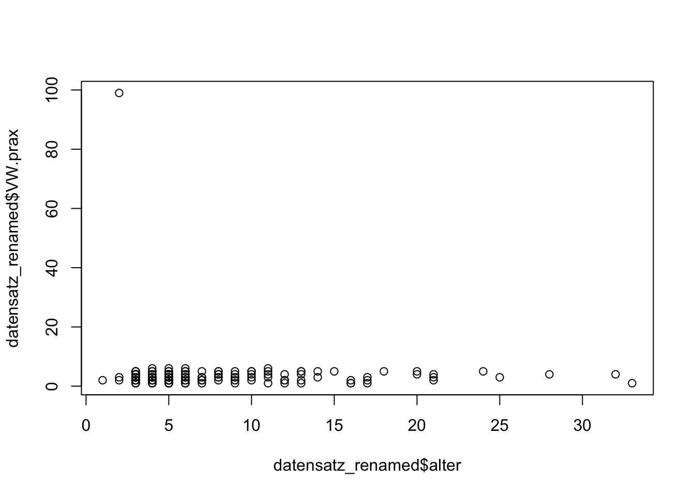

# Datenaufbereitung in R: Praxisguide
*Autoren: Daniel Rehfeldt, Martin Brämer*

Herzlich Willkommen zum Beitrag *Datenaufbereitung in R*. Um einige Funktionen nutzen zu können, werden zunächst Pakete in R installiert und geladen:


```r
# Installiere und lade die benötigten Pakete

# install.packages("xlsx")
# install.packages("foreign")
# install.packages("plyr")
# install.packages("psych")


library(xlsx) # hilft beim Import von Excel-Daten
library(foreign) # hilft beim Import von SPSS-Daten
library(plyr) # enthält die nützliche rename()-Funktion zum Umbenennen von Variablennamen
library(psych) # liefert psychometrische Funktionen
```


## Motivation
Vor jeder statistischen Analyse steht ein nur selten ehrlich beschriebener Prozess, die Datenaufbereitung. Diese ist essenziell, um einen Überblick über die Güte der Rohdaten zu erhalten und überhaupt weitere Analysen adäquat durchführen zu können. Beim manuellen Aufbereiten von Daten, sei es händisch in Excel oder SPSS, kann es sehr schnell zu Unaufmerksamkeiten und demnach zu Fehlern kommen, die aufgrund ihrer Nicht-Nachvollziehbarkeit schwere Konsequenzen für die Qualität des Datenmaterials und somit die spätere Analyse haben können. Wir verdeutlichen das einmal an einem Beispiel: 

Eine versehentliche Verschiebung der Spaltennamen *um 1 nach rechts* kann dazu führen, dass der komplette Datensatz unnachvollziehbar beschädigt wird. Denn im Nachhinein erscheint es gerade bei großen Datensätzen, die bereits verändert wurden, fast unmöglich zu entscheiden, zu welcher Variable die jeweilige Spalte von Werten gehört.

Hier zeigt sich eine Stärke Code-basierter Statistiksoftware: Jede Manipulation am Datensatz ist schriftlich fixiert und jederzeit retrospektiv nachvollzieh- oder veränderbar.
Das praktische Rüstzeug für eine basale Datenaufbereitung in R soll dieser Praxisguide liefern. Das Wissen zu vielen Basis-Funktionen, Datentypen und vielem mehr sind in unserem vorherigen Kapitel *Basiswissen für R* enthalten, deren Kenntnis in der nachfolgenden statistischen Analyse von Vorteil sein kann.

## Inhalte
Es handelt sich bei allen fortan genutzten Beispielen um Datensätze, die bei Fragebogen-Erhebungen mit Likert-Skalen sowie Angaben zur Person allgemein oder Ähnlichem entstehen. Eine Übertragbarkeit auf andere quantitative Erhebungsformen ist aber oft gegeben.

Der Praxisguide umfasst diverse übliche Schritte der Datenaufbereitung:

1. Importieren von Daten 

2. Überblick über die Daten gewinnen 

3. Anfertigen eines Plans zur Datenaufbereitung 

4. Typische Verfahren der Datenaufbereitung (z. B. Manipulieren von Variablen)  

5. Verschmelzen von Daten (Merging, z. B. bei Längsschnitten).

Dabei wird bis zum Abschnitt \@ref(aufplan) eher funktionsorientiert und unter Nutzung diverser, teils vereinfachter Datensätze operiert, um wesentliche Funktionen für die Datenaufbereitung in R kennenzulernen. Das Herzstück des Beitrags bildet dann die systematische Aufbereitung eines realen, stark *verschmutzten* Datensatzes ab Abschnitt \@ref(aufplan).

Begonnen wird dieser Beitrag aber zunächst mit einer der besten Möglichkeiten der Datenaufbereitung – *schmutzige* Daten gar nicht erst entstehen zu lassen.

### Hinweise für quantitative Befragungen – Präventive Datenaufbereitung {#praeventivedatenaufbereitung}
Die Datenaufbereitung beginnt nicht erst bei der ersten Betrachtung des Rohdatensatzes, sondern bereits vorher – bei einem datensensiblen Befragungsdesign.
Gemeint sind hiermit alle Maßnahmen innerhalb der Befragungssoftware oder des Papierfragebogens, die den Aufwand einer nachträglichen Aufbereitung verringern. 

Ein Beispiel wäre etwa die Nutzung von Personencodes mit Einführung von Restriktionen. Besteht ein solcher Code etwa aus vier Buchstaben und vier Ziffern, so kann ein und dieselbe Person z. B. "ERNW1665" oder "ernw1665" oder "eRnW1665" schreiben. Wird hier – sofern die Erhebungssoftware dies erlaubt – die Restriktion auf Großbuchstaben eingeführt, so ist ein Aufbereitungsschritt gespart. Wenn zudem (beim Online-Fragebogen) die Restriktion eingeführt wird, dass der Fragebogen nur fortgesetzt werden kann, wenn tatsächlich vier Buchstaben, gefolgt von vier Ziffern niedergeschrieben wurden, vermeidet man Codes wie "ERNW16", "1665" usw. – und ja, dies sind reale Beispiele.

Weiters sollten Antwortoptionen erschöpfend sein [@porst_fragebogen_2014], um die Datenaufbereitung und -interpretation zu gewährleisten. Die Frage *Welche der folgenden Fächer belegten Sie im Abitur?*, gefolgt von den Ankreuzmöglichkeiten *Physik* und *Chemie* führt nämlich zu der Frage, welche Interpretation erfolgt, wenn keine der beiden Möglichkeiten angekreuzt wurde. Hat die Person die Frage übersprungen? Hat sie beide Fächer nicht belegt? Es müsste hier die Antwortoption *keine der beiden* unbedingt ergänzt werden.
Ein letztes exemplarisches Beispiel ist die Abitur- oder Hochschulzugangsberechtigungsnote. Die Wahl eines Freitextfeldes zur Beantwortung der Frage ist hier unbedingt zu vermeiden, da sonst Antworten wie "sehr gut", "weiß ich nicht", "zweikommazwei", "1.3" oder "1,7" erfolgen können, ein Albtraum für die Datenaufbereitung. Wir empfehlen hier je nach Genauigkeitswunsch entweder a) das Nutzen von Ankreuzmöglichkeiten in *Ranges*, also "1,0–1,3", "1,4–1,7", …, und *weiß ich nicht* oder bei guter Befragungssoftware das Nutzen von Feldern, die nur die Schreibweise `[Ziffer],[Ziffer]` zulassen.

## Daten importieren
Nun beginnt der tatsächliche Anwendungsfall einer Datenbereinigung mit einem großen und unübersichtlichen Datensatz, der mit dem Import der Daten in R beginnt. Je nach Ausgangsformat der Daten gibt es hierzu eine Anleitung. R bietet den großen Vorteil, dass es mit allen regulären und auch exotischen Datentypen umgehen kann.

An dieser Stelle erscheint es zudem wichtig, eine gängige Praxis beim Erstkontakt mit Rohdaten anzusprechen: Rohdaten sollten sofort nach dem Erhalt kopiert und separat gespeichert werden. Diese Rohdaten sollten *in keiner Weise* verändert oder manipuliert werden, sie dienen als wertvolle Rückversicherung, falls bei der Datenaufbereitung und/oder dem Abspeichern manipulierter Daten ein gravierender Fehler unterlaufen sollte.

### Import von Excel
Daten, die auf `.xlsx` oder `.xls` enden, können folgendermaßen importiert werden:
```
demodata_xlsx <- read.xlsx("Dateiname.xlsx", 1) # "Dateiname.xls" bei xls-Dateien 
```

Dies importiert einen Standard-Excel-Datensatz korrekt, der Daten im Excel-Arbeitsblatt 1 enthält und in der ersten Zeile die Variablennamen enthält. Weitere Optionen siehe [hier](https://cran.r-project.org/web/packages/xlsx/xlsx.pdf).

### Import von CSV
Daten die auf .csv enden, können folgendermaßen importiert werden:
```
demodata_csv <- read.csv2(file = "Dateiname.csv")  
```

Falls der Import fehlschlägt, meist wegen Heterogenität der csv-Formatierungen, gibt es [hier](https://www.rdocumentation.org/packages/utils/versions/3.6.2/topics/read.table) Hilfe.


### Import von SPSS
Daten die auf *.sav* enden und aus SPSS stammen, können folgendermaßen importiert werden (mehr Erläuterungen finden sich  [hier](https://www.rdocumentation.org/Pakete/foreign/versions/0.8-82/topics/read.spss)):

```
demodata_spss <-
  read.spss(
    "Dateiname.sav",
    use.value.labels = F,
    to.data.frame = T,
    use.missings = T,
    trim.factor.names = T
  ) 
```

Die angegebenen Optionen stellen in vielen Fällen eine gute Ausgangsbasis dar. Sie werden hier einmal erläutert:

`use.value.labels=F`
Gerade Ratingskalen-Items (z. B. *stimme nicht zu* bis *stimme voll zu*) werden beim automatischen Import als Factor-Variablen deklariert (mit z. B. den Levels *stimme nicht zu*, *stimme ein wenig zu*, *stimme zu*, *stimme voll zu*). Wenn dies gewünscht ist, kann die Option auf `TRUE` gesetzt werden. Setzt man auf `FALSE`, so werden die Antwort-Optionen als Zahlen angegeben, also z.B. 1 bis 4. Dies gilt dann aber auch für *echte* Factor-Variablen, wie das Geschlecht, hier sollte nachträglich im SPSS-Datensatz eine Rückversicherung stattfinden, ob etwa bei der Variablen `Geschlecht` die Zahl 1 der Ausprägung *männlich*, *weiblich* oder *divers* entsprach.

`to.data.frame = T`
Damit werden SPSS-Daten standardmäßig als Dataframe importiert.

`use.missings = T`
Dies ist relevant, falls in SPSS verschiedene Arten von missing values definiert wurden (z. B. *missing at random*, *missing by design* usw.). Diese Informationen bleiben so erhalten.

`trim.factor.names = T`
Factor-Variablen werden beim Import automatisch erkannt, diese Option sorgt dafür, dass am Anfang und Ende eines Factor-Level-Namens keine Leerzeichen stehen, also z.B. `"Gruppe 1"` statt `" Gruppe 1	"`.

## Überblick über die Daten verschaffen
Nach dem Daten-Import sollte zunächst ein Überblick über die neuen Dataframes in R gewonnen werden.

### Erster Überblick mit den Funktionen `nrow()`, `ncol()` und `View()`

#### `nrow() und ncol()`
Diese beiden basalen und oft nützlichen Funktionen liefern die Anzahl der Zeilen (`nrow()`, i. d. R. Proband:innenanzahl) respektive die Anzahl der Spalten (`ncol()`, i. d. R. Variablenanzahl). Nach der Datenbereinigung (also bspw. dem Entfernen von Missings) kann über `nrow()` z. B. die Stichprobengröße ermittelt werden. `ncol()` dient z. B. zur Überprüfung, ob nach komplexen Operationen die verbleibende Variablenzahl plausibel ist.

Wir benötigen zunächst einen Datensatz. Er ist im [GitHub-Verzeichnis](https://github.com/dbuschhue/P4-Worflow/blob/master/data_for_chapters/baseknowledge_R/df_unrein_1_neu.rds) dieser Publikation verfügbar.


```r
# Importiert den Datensatz. Dieser liegt im R-eigenen rds-Format vor:
datensatz_roh <- readRDS(file = "./data_for_chapters/baseknowledge_R/df_unrein_1_neu.rds") 

#speichere ein Duplikat des datensatz_roh für spätere Reaktivierung:
datensatz_roh_duplikat_1 <- datensatz_roh 
```


```r
# View(datensatz_roh) # Dies wird ausgeführt, um einen visuellen Gesamteindruck zu erhalten.

# Aus View() wird deutlich: 
  # 1) Erst ab Person 11 sind sinnvolle Personencodes vorhanden 
  # (die ersten 10 waren Testdurchläufe der Testleitenden)
  # 2) Die Variable "dozent" enthält IMMER den Text "brämer"

# Es folgt ein Beispiel zur Nutzung von nrow() und ncol():

nrow(datensatz_roh) #Zeilen (Personen) Zahl vorher
```

```
## [1] 546
```

```r
datensatz_bearbeitet <- datensatz_roh[-c(1:10),] #Entferne die ersten 10 Zeilen (= Personen)

nrow(datensatz_bearbeitet) #Zeilen (Personen) Zahl hinterher
```

```
## [1] 536
```

```r
ncol(datensatz_bearbeitet) #Spalten (Variablen) Zahl vorher
```

```
## [1] 18
```

```r
names(datensatz_bearbeitet) # Prüfe, an welcher Stelle des Datensatzes die Variable "dozent" steht
```

```
##  [1] "pcode"                  "VW.theo"                "VW.prax"               
##  [4] "VW.plan"                "VW.durch"               "VW.reflex"             
##  [7] "Abitur_Fach_Biologie"   "Abitur_Fach_Chemie"     "Abitur_Fach_Geographie"
## [10] "Abitur_Fach_Geschichte" "Abitur_Fach_Informatik" "Abitur_Fach_Physik"    
## [13] "Abitur_Fach_PW"         "geschlecht"             "alter"                 
## [16] "semester.pre"           "abi"                    "dozent"
```

```r
# Es ist also die Stelle 18

datensatz_bearbeitet <- datensatz_bearbeitet[,-c(18)] #entferne Variable 18, dozent.

ncol(datensatz_bearbeitet) #Spalten (Variablen) Zahl hinterher
```

```
## [1] 17
```

### Vertiefung der `View()`-Funktion
Einen, wie oben bereits angedeutet, eher gewohnten, grafischen Überblick gibt die `View()`-Funktion (vgl. Abb.   \@ref(fig:view-tab) und \@ref(fig:view-funk)), wir stellen vorher noch den Rohdatensatz wieder her:


```r
#wiederherstellen des Rohdatensatzes
datensatz_roh <- datensatz_roh_duplikat_1
```


```r
View(datensatz_roh)
```


<div class="figure" style="text-align: center">

<p class="caption">(\#fig:view-tab)View-Tab in RStudio (von Daniel Rehfeldt)</p>
</div>
  

<div class="figure" style="text-align: center">

<p class="caption">(\#fig:view-funk)Filter-Funktion und *Show in new Window*-Funktion (von Daniel Rehfeldt)</p>
</div>


In den Abbildungen \@ref(fig:view-tab) und \@ref(fig:view-funk) sind die verschiedenen Funktionen innerhalb der View-Ansicht hervorgehoben. Damit lässt sich 

a) der Datensatz in einem eigenen Fenster anzeigen. 
b) ein Filter hinzufügen (z. B. Ansicht so, dass nur diejenigen Personen zu sehen sind, die Physik im Abitur hatten).
c) im Datensatz eine Stichwortsuche vollführen. 
d) der Datensatz nach einer Variablen alphabetisch/numerisch sortieren.

## Umbenennen von Variablen
Es gibt unzählige Wege, Variablen in R umzubenennen. Den für uns anschaulichsten Weg präsentieren wir hier. Der Datensatz für das Beispiel ist im [GitHub-Verzeichnis](https://github.com/dbuschhue/P4-Worflow/blob/master/data_for_chapters/data_cleaning/df_POST_1_neu.rds) dieser Publikation verfügbar.

Im Rahmen der `rename()`-Funktion des `plyr`-Pakets wird immer wieder die Schreibweise `neuer Variablenname = alter Variablenname` benutzt. So bleibt stets ersichtlich, welcher Variablenname durch welchen ersetzt wurde:


```r
# Lade zunächst als Beispiel einen Rohdatensatz mit ungünstigen Variablennamen:
datensatz_unbenannt <- readRDS(file = "./data_for_chapters/data_cleaning/df_POST_1_neu.rds")

# Prüfe die Variablennamen:
names(datensatz_unbenannt) 
```

```
##  [1] "fr_277654" "fr_277655" "fr_277656" "fr_277657" "fr_277658" "fr_277659"
##  [7] "fr_277660" "fr_277661" "fr_277662" "fr_277663" "fr_277664" "fr_277665"
## [13] "fr_277666" "fr_277667" "fr_277668" "fr_277669" "fr_277670" "fr_277671"
```

```r
#Benenne um (hierfür wurde vorher eine Zuordnungstabelle o. Ä. aus dem Erhebungsmanual gebraucht):
datensatz_renamed <- plyr::rename(
  datensatz_unbenannt,
  replace = c(
    "fr_277654" = "pcode",
    "fr_277655" = "VW.theo",
    "fr_277656" = "VW.prax",
    "fr_277657" = "VW.plan",
    "fr_277658" = "VW.durch",
    "fr_277659" = "VW.reflex",
    "fr_277660" = "Abitur_Fach_Biologie",
    "fr_277661" = "Abitur_Fach_Chemie",
    "fr_277662" = "Abitur_Fach_Geographie",
    "fr_277663" = "Abitur_Fach_Geschichte",
    "fr_277664" = "Abitur_Fach_Informatik",
    "fr_277665" = "Abitur_Fach_Physik",
    "fr_277666" = "Abitur_Fach_PW",
    "fr_277667" = "geschlecht",
    "fr_277668" = "alter",
    "fr_277669" = "semester.pre",
    "fr_277670" = "abi",
    "fr_277671" = "dozent"
  )
)

# Variablennamen hinterher:
names(datensatz_renamed)
```

```
##  [1] "pcode"                  "VW.theo"                "VW.prax"               
##  [4] "VW.plan"                "VW.durch"               "VW.reflex"             
##  [7] "Abitur_Fach_Biologie"   "Abitur_Fach_Chemie"     "Abitur_Fach_Geographie"
## [10] "Abitur_Fach_Geschichte" "Abitur_Fach_Informatik" "Abitur_Fach_Physik"    
## [13] "Abitur_Fach_PW"         "geschlecht"             "alter"                 
## [16] "semester.pre"           "abi"                    "dozent"
```

## Erste deskriptive Analyse

Will man einen ersten Überblick über deskriptive, quantitative Statistiken gewinnen (z. B. für Items aus Skalen oder numerische Kovariaten wie das Alter), so stehen diverse Funktionen zur Verfügung, von denen wir einige nun vorstellen.

### Deskriptive Statistiken

Die `summary()`-Funktion liefert in Blöcken einen Überblick über jede Variable, inklusive Mittelwert, Median und fehlenden Werten. Nützlich sind zudem die Angaben des Minimal- und Maximalwertes, z. B., um Skalenwerte außerhalb des definierten Bereichs zu erkennen.


```r
summary(datensatz_renamed)
```

```
##               pcode        VW.theo         VW.prax          VW.plan     
##  ANAN0770        :  2   Min.   :1.000   Min.   : 1.000   Min.   :1.000  
##    Anan1913      :  1   1st Qu.:2.000   1st Qu.: 2.000   1st Qu.:1.000  
##  01.01.2000      :  1   Median :3.000   Median : 3.000   Median :2.000  
##  01.04.1987      :  1   Mean   :2.705   Mean   : 3.061   Mean   :2.566  
##  06              :  1   3rd Qu.:4.000   3rd Qu.: 4.000   3rd Qu.:4.000  
##  1.NA2.NA3.284.10:  1   Max.   :5.000   Max.   :99.000   Max.   :6.000  
##  (Other)         :539   NA's   :221     NA's   :220      NA's   :221    
##     VW.durch      VW.reflex     Abitur_Fach_Biologie Abitur_Fach_Chemie
##  Min.   :1.00   Min.   :1.000   Min.   :1            Min.   :1         
##  1st Qu.:2.00   1st Qu.:1.000   1st Qu.:1            1st Qu.:1         
##  Median :3.00   Median :2.000   Median :1            Median :1         
##  Mean   :2.62   Mean   :2.495   Mean   :1            Mean   :1         
##  3rd Qu.:3.00   3rd Qu.:3.000   3rd Qu.:1            3rd Qu.:1         
##  Max.   :6.00   Max.   :6.000   Max.   :1            Max.   :1         
##  NA's   :220    NA's   :221     NA's   :391          NA's   :466       
##  Abitur_Fach_Geographie Abitur_Fach_Geschichte Abitur_Fach_Informatik
##  Min.   :1              Min.   :1              Min.   :1             
##  1st Qu.:1              1st Qu.:1              1st Qu.:1             
##  Median :1              Median :1              Median :1             
##  Mean   :1              Mean   :1              Mean   :1             
##  3rd Qu.:1              3rd Qu.:1              3rd Qu.:1             
##  Max.   :1              Max.   :1              Max.   :1             
##  NA's   :459            NA's   :391            NA's   :531           
##  Abitur_Fach_Physik Abitur_Fach_PW geschlecht     alter        semester.pre
##  Min.   :1          Min.   :1      1:154      Min.   : 1.000   1 :175      
##  1st Qu.:1          1st Qu.:1      2: 25      1st Qu.: 4.000   3 :  3      
##  Median :1          Median :1      3:  2      Median : 5.000   5 :  1      
##  Mean   :1          Mean   :1      4:365      Mean   : 7.236   NA:367      
##  3rd Qu.:1          3rd Qu.:1                 3rd Qu.: 9.000               
##  Max.   :1          Max.   :1                 Max.   :33.000               
##  NA's   :476        NA's   :462               NA's   :364                  
##       abi           dozent         
##  Min.   :1.100   Length:546        
##  1st Qu.:2.475   Class :character  
##  Median :2.700   Mode  :character  
##  Mean   :2.721                     
##  3rd Qu.:3.100                     
##  Max.   :3.900                     
##  NA's   :364
```

Die `describe()`-Funktion aus dem `psych`-Package liefert je Variable eine Zeile mit deutlich mehr Statistiken. Es sind gültige Fälle (und damit auch fehlende Werte), Mittelwert, Standardabweichung, Median, Min, Max, Schiefe, Kurtosis und Standardfehler angegeben. Für `character`-Variablen erhält man allerdings keine sinnvollen Angaben.


```r
describe(datensatz_renamed)
```

```
##                        vars   n   mean     sd median trimmed    mad min   max
## pcode*                    1 546 272.54 157.70  272.5  272.50 202.37 1.0 545.0
## VW.theo                   2 325   2.70   1.20    3.0    2.69   1.48 1.0   5.0
## VW.prax                   3 326   3.06   5.49    3.0    2.70   1.48 1.0  99.0
## VW.plan                   4 325   2.57   1.34    2.0    2.44   1.48 1.0   6.0
## VW.durch                  5 326   2.62   1.33    3.0    2.50   1.48 1.0   6.0
## VW.reflex                 6 325   2.50   1.28    2.0    2.39   1.48 1.0   6.0
## Abitur_Fach_Biologie      7 155   1.00   0.00    1.0    1.00   0.00 1.0   1.0
## Abitur_Fach_Chemie        8  80   1.00   0.00    1.0    1.00   0.00 1.0   1.0
## Abitur_Fach_Geographie    9  87   1.00   0.00    1.0    1.00   0.00 1.0   1.0
## Abitur_Fach_Geschichte   10 155   1.00   0.00    1.0    1.00   0.00 1.0   1.0
## Abitur_Fach_Informatik   11  15   1.00   0.00    1.0    1.00   0.00 1.0   1.0
## Abitur_Fach_Physik       12  70   1.00   0.00    1.0    1.00   0.00 1.0   1.0
## Abitur_Fach_PW           13  84   1.00   0.00    1.0    1.00   0.00 1.0   1.0
## geschlecht*              14 546   3.06   1.36    4.0    3.20   0.00 1.0   4.0
## alter                    15 182   7.24   5.58    5.0    6.10   2.97 1.0  33.0
## semester.pre*            16 546   3.03   1.40    4.0    3.16   0.00 1.0   4.0
## abi                      17 182   2.72   0.48    2.7    2.74   0.44 1.1   3.9
## dozent*                  18 546   1.00   0.00    1.0    1.00   0.00 1.0   1.0
##                        range  skew kurtosis   se
## pcode*                 544.0  0.00    -1.21 6.75
## VW.theo                  4.0  0.10    -1.15 0.07
## VW.prax                 98.0 16.34   282.54 0.30
## VW.plan                  5.0  0.48    -0.78 0.07
## VW.durch                 5.0  0.51    -0.53 0.07
## VW.reflex                5.0  0.49    -0.75 0.07
## Abitur_Fach_Biologie     0.0   NaN      NaN 0.00
## Abitur_Fach_Chemie       0.0   NaN      NaN 0.00
## Abitur_Fach_Geographie   0.0   NaN      NaN 0.00
## Abitur_Fach_Geschichte   0.0   NaN      NaN 0.00
## Abitur_Fach_Informatik   0.0   NaN      NaN 0.00
## Abitur_Fach_Physik       0.0   NaN      NaN 0.00
## Abitur_Fach_PW           0.0   NaN      NaN 0.00
## geschlecht*              3.0 -0.78    -1.34 0.06
## alter                   32.0  2.15     5.14 0.41
## semester.pre*            3.0 -0.74    -1.44 0.06
## abi                      2.8 -0.33     1.07 0.04
## dozent*                  0.0   NaN      NaN 0.00
```

Für deskriptive Statistiken bei Gruppenvergleichen lohnt sich ein Blick auf `describeBy()` aus dem `psych`-Package. Hier wird über ein zweites Argument `group = Gruppierungsvariable` eine Variable festgelegt, die die Auswertung je Gruppe separat ermöglicht. Der Output zeigt die identischen Statistiken wie `describe()`, allerdings je Gruppe.
Empfehlenswert ist diese Funktion aber meist erst nach einer groben Datenbereinigung, in unserem Fall müsste beispielweise bei der Variablen *Abitur_Fach_Physik* der Wert `NA` teils durch 0 ersetzt werden, mehr dazu in Abschnitt \@ref(nominalvars).

Soll ein Überblick über Kreuztabellen gewonnen werden, bietet sich die `table()`-Funktion an. Diese liefert theoretisch in unserem Beispiel die Anzahlen der Proband:innen, die sowohl Physik als auch Biologie im Abitur belegten, die Anzahl der Proband:innen, die weder Physik noch Biologie belegten und die Anzahlen derjenigen, die je eines, aber nicht das andere belegten.

Die erste Variable in `table(Variable 1, Variable 2)` steht im Output immer links und die zweite oben.


```r
table(datensatz_renamed$Abitur_Fach_Biologie, datensatz_renamed$Abitur_Fach_Physik)
```

```
##    
##      1
##   1 56
```

Interpretation: Es wird nur der Fall (1, 1) angezeigt, also diejenigen Personen, die sowohl Physik, als auch Biologie belegten. Weshalb dies so angezeigt wird, kann über eine Inspektion mittels `View()` nachvollzogen werden:


```r
View(datensatz_renamed[,c("Abitur_Fach_Physik","Abitur_Fach_Biologie")])
```

Es ist hier ersichtlich, dass im Datensatz (durch die Erhebungssoftware begründet) je `NA`, also ein fehlender Wert vergeben wurde für `nicht im Abitur belegt`. R schließt diese fehlenden Werte bei vielen Funktionen aus Analysen aus.

Es gibt aber auch oft Möglichkeiten, diese `NA` in der Analyse anzuzeigen, bei der `table()`-Funktion gelingt dies mit `useNA`:


```r
table(datensatz_renamed$Abitur_Fach_Biologie, datensatz_renamed$Abitur_Fach_Physik, useNA = "always")
```

```
##       
##          1 <NA>
##   1     56   99
##   <NA>  14  377
```

Interpretation: 377 Studierende belegten weder Physik noch Biologie, 56 beides, 14 nur Physik und 99 nur Biologie. 

Notiz für die spätere umfassende Datenaufbereitung: Die `NAs` in den Abitur-Variablen sollten in typische Werte wie z. B. *0 = nein* überführt werden.

### Graphische Übersicht

`hist()` und `plot()`

Für nummerische Variablen kann mittels `hist(Datensatz$Variable)` ein Histogramm erzeugt werden:


```r
hist(datensatz_renamed$alter)
```

<div class="figure" style="text-align: center">

<p class="caption">(\#fig:histdf)Histogramm</p>
</div>

Interpretation: Hier ist zukünftig wohl eine Datenaufbereitung nötig, es handelte sich nämlich ausschließlich um erwachsene Studierende und das Alter umfasst im Histogramm scheinbar auch Kinder und Jugendliche.

Die Funktion `plot(Datensatz$Variable1, Datensatz$Variable2)` kann einen Scatterplot erzeugen:


```r
plot(datensatz_renamed$alter, datensatz_renamed$VW.prax)
```

<div class="figure">

<p class="caption">(\#fig:plotdf)Scatterplot</p>
</div>

Interpretation: In der Variablen `VW.prax` scheint es einen Ausreißer in der Größenordnung 100 zu geben. Eigentlich verläuft die Skala im Bereich 1 bis 6.

Dies sind zwei basale Visualisierungsoptionen, weitere, professionellere Optionen liefert z. B. das Paket `ggplot`. Damit gelingt auch eine professionell gestaltete Präsentation von Analyseergebnissen, nachfolgend finden sich Beispiele:


## Einen Aufbereitungsplan machen
### Beispiele für *schmutzige* Daten
Nachdem ein Überblick über die Daten gewonnen wurde, sind bereits einige Bereinigungsschritte deutlich geworden, hier ein paar Beispiele:

-	Es gibt leere oder spaltenweit identisch ausgeprägte Variablen, z. B. *Dozent*, stets mit der Ausprägung *Brämer*. 
-	Variablennamen sind nicht adäquat, das Programm Unizensus der Freien Universität Berlin etwa liefert standardmäßig durchnummerierte Variablennamen wie *fr_122350*, die nichts über den Inhalt der Variablen aussagen und aussagekräftig umbenannt werden sollten.
-	Es existieren leere Zeilen, also Proband:innen, die keine Frage beantwortet haben. Dies können Testversuche der Testentwickelnden vor dem eigentlichen Befragungsstart gewesen sein oder schlicht Proband:innen, die die Umfrage nur scheinbar absolviert haben.
-	Es gibt identische Fälle (Zeilen) im Datensatz. Dies kann Erhebungssoftware-bedingt sein oder durch Verschmelzen von Datensätzen passieren.
-	Variablen weisen inadäquate Ausprägungen auf, dies konnte bereits im Scatterplot in Abb. \@ref(fig:plotdf) vermutet werden. Ein anderes Beispiel sind Variablen wie *Seminar* mit den Ausprägungen 1, 2 und 3. Diese könnte bspw.  eine Frage an die Proband:innen danach sein, welches Seminar sie gerade besuchen, das bei Herrn Müller, bei Frau Genf oder bei Frau Darn. Je nach Anordnung dieser Antwortoptionen kann nun 1 für Herrn Müller, Frau Genf oder Frau Darn stehen, dies sollte deutlicher aus der Variablen herauszulesen sein, beispielweise über die Bennenung als `factor`-Variablen (vgl. z. B. Abschnitt \@ref(nominalvars)).
-	Likert-skalierte Variablen sind manchmal invertiert, z. B. wenn bei Fragebögen einmal positiv und einmal negativ gepolt befragt wird (*Physik macht mir Spaß.* vs. *Physik reizt mich nicht.*).
-	Zur Anonymisierung verwendete Personencodes wurden von den Proband:innen uneinheitlich eingegeben, etwa `ERHU0502`, `ebji8706`, `ER33   ` usw. 
-	Eine Variable enthält versetzte Werte: Beispiel: *Alter in Jahren* wurde über ein Dropdown-Menü mit den Zahlen 17 bis 70 (für Studierende) erfragt. Nun setzt das Erhebungsprogramm z. B. eine "1" für 17 Jahre, eine "2" für 18 Jahre usw. Es gibt also einen Versatz von 16 Jahren.
-	Textlastige Variablen weisen Leerzeichen o. Ä. am Anfang und/oder Ende der Antwort auf. Ein Beispiel: Die Variable *Kommentar* wird zur Erfassung von Kommentaren zur Erhebung genutzt und darf mit bis zu 160 Zeichen beschrieben werden. Darin finden sich Antworten wie "     Ich fand die Befragung zu lang     ". Dies kann zu Darstellungsproblemen in R führen.
-	Beim Import von Variablen kann die automatische Erkennung und Faktorisierung von Variablen nützlich sein, die numerischen Ausprägungen der Antwortoptionen sind allerdings manchmal unbrauchbar. Ein Beispiel: Die Variable `geschlecht` mit Antwortoptionen wie *männlich*, *weiblich*, *divers* , *keine Angabe* wurde beim Import automatisch faktorisiert. Die zu den Labels *männlich*, *weiblich*, *divers*, *keine Angabe* gehörenden numerischen Werte wurden als 2, 3, 4 und 5 festgelegt.
-	Fehlende Werte enthalten eigentlich Informationen: Eine Frage wie *Welche dieser Fächer belegten Sie im Abitur (Mehrfachantworten möglich)?* 

a) Physik
b) Chemie
c) Biologie 

Dies wird von mancher Erhebungs-Software in drei dichotome *Ja/NA-Variablen* aufgeteilt, in denen sie das setzen eines Kreuzes als *Ja*, das weglassen als `NA` registrieren. Das Weglassen des Kreuzes entspricht in diesem Beispiel allerdings einem *Nein*. Steht jedoch bei allen drei Fächern ein `NA`, so ist nicht klar, ob die Person die Frage einfach nicht beantwortet hat, oder ob sie tatsächlich alle drei Fächer nicht im Abitur belegt hatte. Eine weitere Antwortoption  *keine dieser drei* oder eine freie Antwortmöglichkeit *Sonstiges, und zwar* wäre hier sinnvoll (vgl. Abschnitt \@ref(praeventivedatenaufbereitung)).

### Detaillierte Erstellung eines Aufbereitungsplans an einem echten Beispiel {#aufplan}
Wir starten mit dem Import der Rohdaten und mit der `View()`-Funktion, um Informationen für unseren Aufbereitungsplan zu erhalten:


```r
# Importiere Rohdaten. Diese liegen hier im R-eigenen rds-Format vor:
datensatz_roh <- readRDS("./data_for_chapters/data_cleaning/df_POST_1_neu.rds")
```

```r
View(datensatz_roh)
```

Zunächst sollte ein Umbennenen der Variablen erfolgen. Hilfreich kann dazu das Original-Befragungsdokument sein oder eine Tabelle, die vor der Befragung die Reihenfolge der Items festlegte (Noch besser wäre eine Befragungssoftware, in der die Namen selbst festgelegt werden können, z. B. [SosciSurvey](https://www.soscisurvey.de/en/index)).


```r
datensatz_renamed <- plyr::rename(datensatz_roh,
                   replace=c("fr_277654"="pcode",
                             "fr_277655"="VW.theo",
                             "fr_277656"="VW.prax",
                             "fr_277657"="VW.plan",
                             "fr_277658"="VW.durch",
                             "fr_277659"="VW.reflex",
                             "fr_277660"="Abitur_Fach_Biologie",
                             "fr_277661"="Abitur_Fach_Chemie",
                             "fr_277662"="Abitur_Fach_Geographie",
                             "fr_277663"="Abitur_Fach_Geschichte",
                             "fr_277664"="Abitur_Fach_Informatik",
                             "fr_277665"="Abitur_Fach_Physik",
                             "fr_277666"="Abitur_Fach_PW",
                             "fr_277667"="geschlecht",
                             "fr_277668"="alter",
                             "fr_277669"="semester.pre",
                             "fr_277670"="abi",
                             "fr_277671"="dozent"
                   ))
#Überprüfe:
names(datensatz_renamed)
```

```
##  [1] "pcode"                  "VW.theo"                "VW.prax"               
##  [4] "VW.plan"                "VW.durch"               "VW.reflex"             
##  [7] "Abitur_Fach_Biologie"   "Abitur_Fach_Chemie"     "Abitur_Fach_Geographie"
## [10] "Abitur_Fach_Geschichte" "Abitur_Fach_Informatik" "Abitur_Fach_Physik"    
## [13] "Abitur_Fach_PW"         "geschlecht"             "alter"                 
## [16] "semester.pre"           "abi"                    "dozent"
```

```r
# Überblicke den Datensatz:
View(datensatz_renamed)
```

Die erste Variable stellt augenscheinlich den Personencode (*pcode*) dar. Für unsere Studie hatten wir einen Personencode genutzt, der aus vier Großbuchstaben und vier Ziffern bestand.
Wir entdecken hier folgende Unzulänglichkeiten (z. B. über `View(df)`):

1. Manche pcodes enthalten ein Datum.
2. Manche pcodes sind kürzer als acht Stellen.
3. Manche pcodes sind länger als acht Stellen.
4. Manche pcodes enthalten Kleinbuchstaben.
5. Es gibt Kombinationen aus den obigen vier Fällen.

Zudem sollte auf doppelt vorkommende Personencodes geprüft werden, die ggf. ausgeschlossen werden müssen, da es sich um doppelte Zeilen handeln könnte.

Wir können für den Aufbereitungsplan also schreiben:

```
# Aufbereitungsplan
	# Personencode (1. Spalte, pcode)
		# Suche nach pcodes kleiner/größer 8 Stellen und ersetze durch NA
		# Ersetze Kleinbuchstaben durch Großbuchstaben
		# Suche nach pcodes mit Datum (z. B. Punkt "." suchen)  und ersetze durch NA
		# Suche nach doppelten pcodes und lösche Zeile, falls Duplikat einer anderen Zeile
		# Prüfe mit View(), ob danach noch Aufbereitung nötig
```

Zu beachten ist hier, dass mit denjenigen Bereinigungen gestartet wird, die möglichst viele Fälle erfassen. So ist etwa das Datum "01.01.2001" auch länger als 8 Zeichen, wird also durch den ersten Punkt in unserer Liste gleich miterfasst.
Weiter kann Ausschau gehalten werden nach Bereinigungen, die global für alle Personencodes ausgeführt werden können, wie hier das Ersetzen von Klein- durch Großbuchstaben. So wird in weiten Teilen vermieden, jeden unregelmäßigen pcode einzeln verändern zu müssen.
Entscheidend ist am Ende das Prüfen, ob weitere Aufbereitungen nötig sind, hier verbleiben dann manchmal Fälle, die tatsächlich einzeln zu ändern sind.

Anmerkung: Zum Erhalt von Daten kann statt unregelmäßige pcodes `NA` zu setzen auch milder verfahren werden. Denkbar wäre z. B. das speichern der *Roh-Personencodes* in einer neuen Variablen `pcode_roh`, um bei späterem *matching* von Personencodes (z. B. Längsschnitt) bei hinreichend ähnlichen, unkonformen pcodes doch noch ein matching zu erhalten.

Die Variablen in den Spalten 2 bis 6 stellen Likert-skalierte Items zur Abfrage von Vorwissen von 1 (niedrig) bis 6 (hoch) dar. Hier fällt auf, dass sehr viele Personen fehlende Werte (`NA`) aufweisen. Während der Umgang mit fehlenden Werten nicht Teil dieses Beitrags ist, kann zumindest für unseren Aufbereitungsplan festgehalten werden, dass Personen mit sehr hohen missing-Anteilen (z. B. 60%) als nicht valide Datenquellen gelten und aus der Analyse ausgeschlossen werden können.
Zusätzlich kann gerade bei Likert-skalierten, also rein numerischen Variablen noch einmal geschaut werden, ob alle Ausprägungen auch im intendierten Bereich (hier 1 bis 6) liegen.

Dies können wir schnell mit der `summary()`-Funktion prüfen:


```r
summary(datensatz_renamed[,2:6])
```

```
##     VW.theo         VW.prax          VW.plan         VW.durch   
##  Min.   :1.000   Min.   : 1.000   Min.   :1.000   Min.   :1.00  
##  1st Qu.:2.000   1st Qu.: 2.000   1st Qu.:1.000   1st Qu.:2.00  
##  Median :3.000   Median : 3.000   Median :2.000   Median :3.00  
##  Mean   :2.705   Mean   : 3.061   Mean   :2.566   Mean   :2.62  
##  3rd Qu.:4.000   3rd Qu.: 4.000   3rd Qu.:4.000   3rd Qu.:3.00  
##  Max.   :5.000   Max.   :99.000   Max.   :6.000   Max.   :6.00  
##  NA's   :221     NA's   :220      NA's   :221     NA's   :220   
##    VW.reflex    
##  Min.   :1.000  
##  1st Qu.:1.000  
##  Median :2.000  
##  Mean   :2.495  
##  3rd Qu.:3.000  
##  Max.   :6.000  
##  NA's   :221
```

Die Variable `VW.prax` weist einen maximalen Wert 99 auf, der wahrscheinlich einem fehlenden Wert im importierten Datenformat entsprach. Eine Nachprüfung ergab, dass es sich hierbei um einen regulären fehlenden Wert handelte.

Zudem ist, das wissen wir aus der Erhebung, das Skalen-Item `VW.reflex` invertiert gepolt (*Ich hatte kein besonderes Vorwissen zum Thema Reflexion.*), so dass eine Umpolung erfolgen muss, wenn etwa später Skalenscores berechnet werden sollen.

Wir fügen also zum Aufbereitungsplan hinzu:
```
#Likert-skalierte Variablen allgemein
	#Ersetze in allen Likert-skalierten Variablen "99" durch NA
#Variablen Vorwissen (2 bis 6)
	#Schließe Personen aus, die in ALLEN Variablen missing-Quoten von über 60% aufweisen.
# Variable VW.reflex: Umpolen
```
Hierbei ist die Reihenfolge der beiden Operationen wichtig, da durch die erste Bereinigung neue NAs entstehen könnten.

Weiter geht es mit den Variablen zur Wahl der Abiturfächer in den Spalten 7 bis 13. Hier ist ersichtlich, dass es anscheinend nur die Ausprägungen `NA` und 1 gibt, wir prüfen kurz mit der `summary()`-Funktion und es bestätigt sich. Die Items waren so gestellt, dass die Personen je Abiturfach entweder ein Häkchen setzen konnten für *im Abitur belegt* oder das Ankreuzfeld leer ließen für *nicht im Abitur belegt*. Problematisch ist nun, dass kein Wert in den Variablen existiert, der auf ein klares *Nein* hindeutet. Es finden sich nur `NAs`, die entweder 

a) bedeuten, dass ein Fach **nicht** im Abitur gewählt wurde oder 
b) dass es sich um einen fehlenden Wert handelt, die Person etwa die Frage übersprungen hat.

Dieser Fall stellt also eine Herausforderung für die Datenbereinigung dar.
Nach einiger Überlegung kann folgendes festgehalten werden:

1. Personen, die mindestens bei einem Fach eine 1 für *Ja* aufweisen, können wohl guten Gewissens als Personen angesehen werden, die alle Fragen zum Abitur beantwortet haben. Die `NAs` in den je anderen Abitur-Variablen dieser Personen können also `0 = Nein` gesetzt werden.
2. Schwieriger ist es bei Personen, die **überall** in den Abitur-Variablen `NA` aufweisen. Aufgrund der Fülle an ankreuzbaren Abiturfächern kann allerdings mit recht gutem Gewissen darauf geschlussfolgert werden, dass die Personen tatsächlich diese Items nicht bearbeitet haben, die `NAs` bleiben hier also bestehen.
3. Wenn diese Änderungen vorgenommen sind, könnten diese Variablen in `Factor`-Variablen mit `0 = nein` und `1 = ja` umgewandelt werden.

Wir ergänzen für den Aufbereitungsplan:

```
# Abitur-Fachwahl-Variablen (7 bis 13)
	# Ersetze nur für Personen mit mind. einer 1 = "ja" die NAs in den Abitur-Fachwahl-
	# Variablen durch 0 = Nein
	# Wandle die Variablen in Factor-Variablen (0=nein, 1=ja) um
```

Die nächste Variable ist `geschlecht` mit den Ausprägungen 1, 2, 3 und 4. Zur Identifikation, welche der Zahlen zu welchem der Geschlechter (weiblich, männlich, divers, keine Angabe) gehören, kann wieder ein Blick in das Befragungstool oder das Forschungstagebuch helfen. In diesem Fall stellte sich heraus: `1=weiblich, 2=männlich, 3=divers, 4=keine Angabe`. Das Geschlecht ist eine prädestinierte `Factor`-Variable, da sie oft zur Gruppenbildung herangezogen wird. Wir halten also im Aufbereitungsplan fest:

```
# Geschlecht (14)
	# Wandle in Factor-Variable um, 1=weiblich, 2=männlich, 3=divers, 4=keine Angabe
```

Bei der folgenden Variablen `alter` wird es schwieriger. Ein Blick über die `table()`-Funktion und die Abbildung \@ref(fig:histdf) zeigt, dass die Ausprägungen zwischen 1 und 33 liegen, mit einer Häufung um die Ausprägung 4.
Auch hier kann ein Blick in das Befragungsinstrument helfen. Es wurde hier mit Ankreuzoptionen gearbeitet, die erste war das Alter 17, die zweite 18 usw. Die Forscher:innen wollten damit vermeiden, dass bei einem z. B. offenen Angabefeld Angaben wie "dreiunddreißig" o. Ä. gemacht werden. Da 17 nun dem ersten Ankreuzfeld entsprach, scheint die Befragungssoftware dafür eine 1 gesetzt zu haben. Es gilt also `1 = 17, 2 = 18` usw. Die Daten sind also systematisch zu verändern mit der Operation `+16`.
Wir ergänzen zum Aufbereitungsplan:

```
# Alter (15)
	# Addiere 16 auf alle Altersangaben
```

Die drittletzte Variable `semester.pre` stellt das Hochschulsemester zum Befragungszeitpunkt (hier PRE) dar. Über `table()` wird ersichtlich, dass trotz Befragung im *1. Semester* nicht alle Ausprägungen 1 sind, es sind drei Personen im 3. und eine Person im 5. Semester vorhanden. Die Variable muss augenscheinlich nicht bereinigt werden.
Die vorletzte Variable `abi` enthält die numerische Hochschulzugangsberechtigungsnote. Ein Blick in die `summary()`-Funktion zeigt ein Minimum von 1.1 und ein Maximum von 3.9. Die Variable scheint ebenso keine Datenbereinigung zu benötigen.
Die letzte Variable `dozent` enthält buchstäblich immer denselben Wert, nämlich den Text (*String*) `Brämer`. Ist geplant, weitere Erhebungen bei anderen Dozierenden zu unternehmen, kann diese Variable nützlich werden, um etwa Dozierendeneffekte einer Intervention zu untersuchen. In unserem Fall ist allerdings lediglich eine PRE-POST-Untersuchung mit stets demselben Dozenten *Brämer* geplant gewesen, daher kann diese – vom Befragungstool automatisch kreierte – Variable einfach gelöscht werden:

```
# Dozent (18)
	#lösche die Variable
```

Zu guter Letzt sollte noch ein Blick auf die Variablentypen geworfen werden, vor allem `factor`-Variablen verhalten sich teils wenig intuitiv und können zunächst einmal in `Character` (Text) oder `Numeric` (Zahl) umgewandelt werden.


```r
str(datensatz_renamed) #zeigt detaillierte Informationen zu u.a. den Variablentypen im Datensatz
```

```
## 'data.frame':	546 obs. of  18 variables:
##  $ pcode                 : Factor w/ 545 levels "  Anan1913  ",..: 2 3 4 5 6 7 8 9 10 11 ...
##  $ VW.theo               : num  4 3 3 2 5 3 2 1 3 4 ...
##  $ VW.prax               : num  4 4 3 1 5 4 2 1 3 3 ...
##  $ VW.plan               : num  2 5 4 1 4 4 5 1 3 2 ...
##  $ VW.durch              : num  2 4 4 1 4 4 5 1 3 2 ...
##  $ VW.reflex             : num  5 4 4 2 5 4 2 1 4 3 ...
##  $ Abitur_Fach_Biologie  : num  NA NA NA NA NA NA NA NA NA NA ...
##  $ Abitur_Fach_Chemie    : num  NA NA NA NA NA NA NA NA NA NA ...
##  $ Abitur_Fach_Geographie: num  NA NA NA NA NA NA NA NA NA NA ...
##  $ Abitur_Fach_Geschichte: num  NA NA NA NA NA NA NA NA NA NA ...
##  $ Abitur_Fach_Informatik: num  NA NA NA NA NA NA NA NA NA NA ...
##  $ Abitur_Fach_Physik    : num  NA NA NA NA NA NA NA NA NA NA ...
##  $ Abitur_Fach_PW        : num  NA NA NA NA NA NA NA NA NA NA ...
##  $ geschlecht            : Factor w/ 4 levels "1","2","3","4": 4 4 4 4 4 4 4 4 4 4 ...
##  $ alter                 : num  NA NA NA NA NA NA NA NA NA NA ...
##  $ semester.pre          : Factor w/ 4 levels "1","3","5","NA": 4 4 4 4 4 4 4 4 4 4 ...
##  $ abi                   : num  NA NA NA NA NA NA NA NA NA NA ...
##  $ dozent                : chr  "Brämer" "Brämer" "Brämer" "Brämer" ...
```

Es zeigt sich, dass folgende Variablen als Factor vorliegen:

- `pcode` $\Rightarrow$ ungünstig, sollte in Character umgewandelt werden, um leichter Umwandlungen vornehmen zu können
- `geschlecht` $\Rightarrow$ ok, sofern die Ziffern ein label erhalten (weiblich, männlich usw.)
- `semester.pre` $\Rightarrow$ ok


Den ersten Punkt fügen wir also noch zu unserem Aufbereitungsplan hinzu, und zwar bevor andere Operationen am pcode vorgenommen werden.

### Aufbereitungsplan
Es ist geschafft, der finale Aufbereitungsplan ist erstellt:
```
# Aufbereitungsplan
	# Personencode (1. Spalte, "pcode")
		#Wandle pcode in Character-Variable um
# Suche nach pcodes kleiner/größer 8 Stellen und ersetze durch NA
		# Ersetze Kleinbuchstaben durch Großbuchstaben
		# Suche nach pcodes mit Datum (Punkt "." suchen)  und ersetze durch NA
		# Suche nach doppelten pcodes
		# Prüfe mit View(), ob danach noch Aufbereitung nötig
#Likert-skalierte Variablen allgemein
		#Ersetze in allen Likert-Skalierten Variablen "99" durch NA
#Variablen Vorwissen (2 bis 6)
#Schließe Personen aus, die in ALLEN Variablen missing-Quoten von über 60% aufweisen.
# Variable VW.reflex: Umpolen
	# Abitur-Fachwahl-Variablen (7 bis 13, "Abitur_Fach_...)
		# Ersetze nur für Personen mit mind. einer 1 = "ja" die NAs in den Abitur-
		# Fachwahl-Variablen durch 0 = Nein
		# Wandle die Variablen in Factor-Variablen (0=nein, 1=ja) um
	# Geschlecht (14, "geschlecht")
		# Wandle in Factor-Variable um, 1=weiblich, 2=männlich, 3=divers, 4=keine Angabe
	# Alter (15, "alter")
		# Addiere 16 auf alle Altersangaben
	# Dozent (18, "dozent")
		#lösche die Variable
```

## Datenaufbereitung durchführen
### Aufbereitung eines Personencodes {#personencode}
Gemäß Aufbereitungsplan sind folgende Operationen zu realisieren:

```
# Personencode (1. Spalte, "pcode")
		#Wandle pcode in Character-Variable um
# Suche nach pcodes kleiner/größer 8 Stellen und ersetze durch NA
		# Ersetze Kleinbuchstaben durch Großbuchstaben
		# Suche nach pcodes mit Datum (Punkt "." suchen)  und ersetze durch NA
# Suche nach doppelten pcodes
		# Prüfe mit View(), ob danach noch Aufbereitung nötig
```
Wir verfahren Schritt für Schritt:
```
#Wandle pcode in Character-Variable um
```
Der Personencode hat sich in der Aufbereitungsplanung als `Factor`-Variable mit über 400 Levels gezeigt. Da dies gerade für das Recodieren einiger pcodes ungünstige Hürden erzeugt, wandeln wir nun in das Format *Character* (Text) um:


```r
datensatz_renamed$pcode <- as.character(datensatz_renamed$pcode)
```

Der Befehl `as.character()` wandelt hierbei jeden anzeigbaren Text in tatsächlichen Text um. Von nun an können wir einfache Veränderungen an einzelnen Personencodes vornehmen.

Wir prüfen den Erfolg der Operation: 


```r
str(datensatz_renamed$pcode)
```

```
##  chr [1:546] "01.01.2000" "01.04.1987" "06" "1.NA2.NA3.284.10" "141651" ...
```

Im nächsten Bereinigungsschritt wird geprüft, ob Personencodes zu wenige oder zu viele Zeichen aufweisen. Im strengsten Fall können diese direkt `NA` gesetzt werden:


```r
# Suche nach pcodes kleiner/größer 8 Stellen und ersetze durch NA
datensatz_renamed$pcode[nchar(datensatz_renamed$pcode) != 8] <- NA #man beachte das UNGLEICH !=
```

Zudem sollen noch Klein- in Großbuchstaben umgewandelt werden:


```r
# Ersetze Kleinbuchstaben durch Großbuchstaben----

datensatz_renamed$pcode <- toupper(datensatz_renamed$pcode)
```

Bei der ersten Durchsicht der Daten zeigten sich auch Personencodes mit einem "." (Punkt) darin:
Um Text bzw. Textteile (wie den Punkt) in R zu suchen, gibt es u. a. die Funktion `grepl()`. Der Aufbau dieser Funktion sieht im einfachsten Fall folgendermaßen aus:

```
grepl("TEXT", Variable oder (Teil-)Datensatz) 
```

Der Output zeigt dann je Variable und Person mit einer 1 oder 0 an, ob der Text gefunden wurde oder nicht. So lassen sich zum Beispiel Personencodes finden und ggf. ändern, die einen Punkt (".") enthalten:


```r
datensatz_renamed[grepl(".", datensatz_renamed$pcode, fixed = T), "pcode"] 
```

```
## character(0)
```

```r
# fixed = T sorgt dafür, dass Sonderzeichen wie ein Punkt oder ein "$" auch als solche
# behandelt werden und nicht als Operatoren.
# Output character(0) zeigt, dass bereits alle pcodes mit einem "." entfernt sind. 
# Dies war bereits durch den vorherigen Schritt mit Zeichenzahl ungleich 8 geschehen.
```

Auch mögliche doppelte Zeilen oder pcodes gilt es zu identifizieren und zu bereinigen:


```r
# Suche nach doppelten pcodes ----
head(duplicated(datensatz_renamed$pcode)) # TRUE zeigt an, dass ein pcode mind. 2mal vorkommt
```

```
## [1] FALSE  TRUE  TRUE  TRUE  TRUE  TRUE
```

```r
# Einen Gesamtüberblick liefert table():
table(duplicated(datensatz_renamed$pcode)) 
```

```
## 
## FALSE  TRUE 
##   515    31
```

```r
# dies ist 31-mal der Fall

datensatz_renamed[duplicated(datensatz_renamed$pcode) == T, "pcode"] 
```

```
##  [1] NA         NA         NA         NA         NA         NA        
##  [7] NA         NA         NA         NA         NA         NA        
## [13] NA         NA         NA         NA         NA         NA        
## [19] NA         NA         NA         NA         NA         NA        
## [25] NA         NA         NA         NA         NA         NA        
## [31] "ANAN0770"
```

```r
# Die meisten Fälle sind einfach doppelte NA, aber 
# Person 31 scheint ein reales Duplikat zu sein

# mit der Bedingung is.na(datensatz_renamed$pcode) == F werden hier alle pcode = NA ausgeschlossen: 
datensatz_renamed[duplicated(datensatz_renamed$pcode) == T &
     is.na(datensatz_renamed$pcode) == F, "pcode"] 
```

```
## [1] "ANAN0770"
```

```r
# speichere extrahierten pcode in neuem (Character-)Objekt "duplicated_pcodes":
duplicated_pcodes <-
  datensatz_renamed[duplicated(datensatz_renamed$pcode) == T &
       is.na(datensatz_renamed$pcode) == F, "pcode"] 

# Einfacher: Bei nur wenigen Fällen kann auch der betreffende pcode einfach kurz kopiert oder notiert werden

# Zur Veranschaulichung: So sieht das erstellte Objekt aus:
duplicated_pcodes
```

```
## [1] "ANAN0770"
```

```r
# prüfe, ob Zeilen identisch sind:
datensatz_renamed[datensatz_renamed$pcode %in% duplicated_pcodes, ]
```

```
##        pcode VW.theo VW.prax VW.plan VW.durch VW.reflex Abitur_Fach_Biologie
## 20  ANAN0770       4       5       6        6         4                    1
## 546 ANAN0770       4       5       6        6         4                    1
##     Abitur_Fach_Chemie Abitur_Fach_Geographie Abitur_Fach_Geschichte
## 20                  NA                      1                     NA
## 546                 NA                      1                     NA
##     Abitur_Fach_Informatik Abitur_Fach_Physik Abitur_Fach_PW geschlecht alter
## 20                       1                 NA             NA          2    13
## 546                      1                 NA             NA          2    13
##     semester.pre abi dozent
## 20             1 3.5 Brämer
## 546            1 3.5 Brämer
```

```r
# Die beiden Fälle sind identisch (für das erste Auftreten 
# des pcodes gilt duplicated=F, für das zweite duplicated = T), 
# das zweite Auftreten des Falls wird also entfernt:
nrow(datensatz_renamed) # Fälle vorher
```

```
## [1] 546
```

```r
datensatz_renamed[duplicated(datensatz_renamed$pcode) == T & is.na(datensatz_renamed$pcode) == F, "pcode"]
```

```
## [1] "ANAN0770"
```

```r
datensatz_renamed <-
  datensatz_renamed[duplicated(datensatz_renamed$pcode) == F &
       is.na(datensatz_renamed$pcode) == F, ] # Achtung: Nur duplicated = FALSE werden 
# ausgewählt. Zugleich werden hier alle pcode = NA ausgeschlossen

nrow(datensatz_renamed) 
```

```
## [1] 514
```

```r
# Fälle hinterher: Es sind 32 weniger: 
  # 31 doppelte pcodes: 
    # 1-mal ANAN0770
    # 30mal NA
  # 1 erster NA-pcode, der bewirkte, dass alle 
  # nachfolgenden duplicated = TRUE gesetzt wurden

datensatz_renamed[duplicated(datensatz_renamed$pcode) == T &
     is.na(datensatz_renamed$pcode) == F, "pcode"] 
```

```
## character(0)
```

```r
# keine doppelten pcodes mehr
```

Nun führen wir noch eine abschließende Prüfung durch:


```r
# Prüfe "per Auge", ob nun noch eine Aufbereitung nötig ist 
View(datensatz_renamed)
```


```r
# Prüfe die Anzahlen gültiger Personencodes:

#zeigt Anzahl fehlender Werte (NA):
sum(is.na(datensatz_renamed$pcode)) 
```

```
## [1] 0
```

```r
#zeigt Anzahl gültiger pcodes:
sum(!is.na(datensatz_renamed$pcode)) 
```

```
## [1] 514
```

Die Bereinigung des Personencodes ist abgeschlossen. Wir indizieren dies über einen neuen Namen für den Datensatz:


```r
datensatz_cleaned_pcode <- datensatz_renamed
```


### Aufbereitung Likert-skalierter Variablen {#likert}
Für die Likert-skalierten Variablen soll gemäß Aufbereitungsplan folgendes erfolgen:

```
	#Likert-skalierte Variablen allgemein
		#Ersetze in allen Likert-skalierten Variablen "99" durch NA
    #Variablen Vorwissen (2 bis 6, "VW...")
      #Schließe Personen aus, die in ALLEN Variablen missing-Quoten von über 60% aufweisen.
      # Variable VW.reflex: Umpolen
```

Ein Problem betraf das Auftreten des Wertes "99" in den Likert-skalierten Vorwissens-Variablen (2 bis 6). Es gilt zunächst, diese Anomalie zu detektieren:


```r
summary(datensatz_cleaned_pcode[,c(2:6)]) 
```

```
##     VW.theo        VW.prax          VW.plan         VW.durch    
##  Min.   :1.00   Min.   : 1.000   Min.   :1.000   Min.   :1.000  
##  1st Qu.:2.00   1st Qu.: 2.000   1st Qu.:1.000   1st Qu.:2.000  
##  Median :3.00   Median : 3.000   Median :2.000   Median :3.000  
##  Mean   :2.71   Mean   : 3.109   Mean   :2.546   Mean   :2.616  
##  3rd Qu.:4.00   3rd Qu.: 4.000   3rd Qu.:4.000   3rd Qu.:3.000  
##  Max.   :5.00   Max.   :99.000   Max.   :6.000   Max.   :6.000  
##  NA's   :221    NA's   :220      NA's   :221     NA's   :220    
##    VW.reflex    
##  Min.   :1.000  
##  1st Qu.:1.000  
##  Median :2.000  
##  Mean   :2.474  
##  3rd Qu.:3.000  
##  Max.   :6.000  
##  NA's   :221
```

```r
# bei VW.prax existiert also eine einzige 99

# Prüfe, welches der zugehörige Personencode ist:
head(datensatz_cleaned_pcode[datensatz_cleaned_pcode$VW.prax == 99, "pcode"])
```

```
## [1] NA         NA         "ALLY2570" NA         NA         NA
```

```r
#ALLY2570 das ist der zugehörige pcode (neben einigen NA-Artefakten)
```

Die Auffälligkeit wurde nur in der Variablen `VW.prax` gefunden und auch nur einmalig. Die 99 tritt bei der Proband:in mit dem Personencode `ALLY2570` auf. Ein Blick in die Ursprungsdaten mit Excel oder ein Betrachten des Fragenbogenentwurfs in der zugehörigen Software offenbart hier, dass es sich bei der 99 um ein reguläres `NA` handelt:


```r
datensatz_cleaned_pcode[datensatz_cleaned_pcode$pcode == "ALLY2570" &
     is.na(datensatz_cleaned_pcode$pcode) == F, "VW.prax"] <- NA # setze den Wert auf NA
```

#### Basale Bereinigung fehlender Werte über Fallausschlüsse
Zunächst sei vorangestellt, dass das Verwerfen von Daten mit einigen Verzerrungen der Ergebnisse einhergehen kann und daher oftmals Imputationen (Rekonstruktionen) fehlender Daten zu bevorzugen sind [@ludtke_umgang_2007]. Für dieses einfache Beispiel möchten wir uns allerdings mit *listenweisen Fallausschlüssen* gemäß missing-Quote begnügen [@field_discovering_2012, S. 216].

Wir benötigen nun zunächst eine Information darüber, welche Personen hohe missing-Quoten von z. B. über 60% aufweisen, also 60% des Fragebogens nicht ausgefüllt haben. Diese Personen sehen wir hier als nicht-zuverlässige Datenquellen an und schließen sie aus der Analyse aus. Da das Feststellen von missing-Quoten eine sehr häufig wiederkehrende Notwendigkeit darstellt, schreiben wir eine Funktion (vgl. Kapitel *Basiswissen für R*), die wir dann stets für diesen Fall nutzen können:

**Funktion 1: help_percentmissing():**
Berechnet je Proband:in (entspricht einer Zeile) den prozentualen Anteil fehlender Werte[^1]:

[^1]: Mit `apply(datensatz, 2, help_percentmissing)` können auch missing-Quoten je Variable bestimmt werden.


```r
help_percentmissing = function(x) {
  sum(is.na(x)) / length(x) * 100 
  # Hier wird die Summe aller Missings durch die Anzahl der 
  # Antworten der Testteilnehmenden geteilt
}
```

Nun wollen wir diese Funktion nicht nur auf eine:n Proband:in, sondern auf den ganzen Datensatz anwenden. Wir schreiben daher eine zweite Funktion, die die erste Funktion direkt nutzt:


```r
percentmissing = function(data) {
  (apply(data, 1, help_percentmissing)) 
  # apply() wendet eine Funktion auf multiple Instanzen an, hier, 
  # symbolisiert durch die "1", auf alle Zeilen des Datensatzes 
  # ("2" wäre für alle Spalten)
}
```

Nun wenden wir `percentmissing()` an:


```r
nrow(datensatz_cleaned_pcode) #Proband:innen vorher
```

```
## [1] 514
```

```r
head(percentmissing(datensatz_cleaned_pcode))
```

```
##       11       12       13       14       15       16 
## 77.77778 77.77778 16.66667 27.77778 22.22222 77.77778
```

Da der Output bei diesem großen Datensatz recht unübersichtlich gerät, bilden wir eine Tabelle. Diese fasst uns Fälle mit gleicher Anzahl prozentualer missings zusammen:


```r
# Die round()-Funktion bewirkt hier zusätzlich eine Darstellung mit zwei  Nachkommastellen:
table(round(percentmissing(datensatz_cleaned_pcode), digits = 2)) 
```

```
## 
##  5.56 11.11 16.67 22.22 27.78 33.33 38.89    50 77.78 
##     7    26    61    57    18    10     2   113   220
```

Der Output zeigt z. B., dass sieben Proband:innen eine missing-Quote von 5.56% aufweisen. Über den Befehl `summary(datensatz)` kann gesehen werden, dass vor allem die Abitur-Variablen (7 bis 13) hohe missing-Quoten aufweisen. Da diese (wie bereits in Abschnitt \@ref(aufplan) dargelegt) teils keine echten missings darstellen, sollten sie (temporär) für die Bestimmung der missing-Quoten ausgeschlossen werden:


```r
table(percentmissing(datensatz_cleaned_pcode[, -c(7:13)])) 
```

```
## 
##                0 9.09090909090909 18.1818181818182 27.2727272727273 
##              177                3              113                1 
## 63.6363636363636 
##              220
```

Das Ergebnis zeigt nun 177 Proband:innen mit missing-Quote 0% und 220 Personen mit über 60% missings.[^2] 

[^2]: Die hohen missing-Quoten stammen aus nicht-erfolgreich verlaufenden matchings und technischen Importartefakten wie ganzen NA-Zeilen: Es sind also *verwaiste* Fälle und technisch bedingte Leerfälle.

Schließe also Proband:innen mit missng-Quote größer 60% aus:

```r
datensatz_cleaned_pcode <-
  datensatz_cleaned_pcode[percentmissing(datensatz_cleaned_pcode[, -c(7:13)]) < 60, ]
nrow(datensatz_cleaned_pcode) #294
```

```
## [1] 294
```

Es verbleiben danach 294 Proband:innen.

Eine weitere zu bereinigende Likert-skalierte Variable war `VW.reflex`, hier sollte eine Umpolung erfolgen:

```
    # Variable VW.reflex: Umpolen
```


```r
table(datensatz_cleaned_pcode$VW.reflex)
```

```
## 
##  1  2  3  4  5  6 
## 79 87 59 47 19  2
```

```r
datensatz_cleaned_pcode$VW.reflex <- 7 - datensatz_cleaned_pcode$VW.reflex
# Hier wird die Formel "7 – Wert" verwendet, um 1 in 6, 2 in 5 usw. zu recodieren.
table(datensatz_cleaned_pcode$VW.reflex)
```

```
## 
##  1  2  3  4  5  6 
##  2 19 47 59 87 79
```

So wird die 1 in die 6 überführt usw.

Die erfolgreiche Datenbereinigung wird erneut durch einen neuen Namen des Datensatzes gekennzeichnet:


```r
datensatz_cleaned_pcode_likert <- datensatz_cleaned_pcode
```

## Aufbereitung nominaler Variablen (z. B. Ja/Nein) {#nominalvars}
Im Aufbereitungsplan zeigten sich die Abitur-Variablen auffällig:

```
# Abitur-Fachwahl-Variablen (7 bis 13, "Abitur_Fach_...)
# Ersetze nur für Personen mit mind. einer 1 = "ja" die NAs in den Abitur-Fachwahl-
# Variablen durch 0 = Nein
		# Wandle die Variablen in Factor-Variablen (0=nein, 1=ja) um
```

Bei diesen nominalen Variablen (z.B. Abitur_Fach_Physik) steht eine 1 für *Ja, im Abitur belegt* und eine 0 für *Nein, im Abitur nicht belegt*. Der Datensatz enthält aber gar keine 0, sondern stets `1` oder `NA`. Personen mit mind. einer 1 sollen daher in den restlichen `NA`-codierten Abitur-Variablen ein `0 = nein` erhalten. Bei Personen mit durchgängig `NAs` sollen diese erhalten bleiben, da die Person offensichtlich keines der Fächer angekreuzt und damit die Fragen mutmaßlich übersprungen hat.

Nun kann das Recodieren beginnen:


```r
# Schritt 1: Setze alle NAs zunächst 0
  # Bem.: is.na()-Funktion lässt sich auch auf ganze Dataframes anwenden. 
  # Diejenigen Personen, die in Variable 7 (erste Abitur-Variable) ein NA aufweisen, 
  # erhalten als Wert in ihrer Variablen 7 eine 0
datensatz_cleaned_pcode_likert[is.na(datensatz_cleaned_pcode_likert[, 7]) == T, 7] <- 0

# Für die zweite Abitur-Variable entsprechend:

datensatz_cleaned_pcode_likert[is.na(datensatz_cleaned_pcode_likert[, 8]) == T, 8] <- 0

# usw. bis 13
```


```r
# oder als Schleife:
for (i in 7:13) {
datensatz_cleaned_pcode_likert[is.na(datensatz_cleaned_pcode_likert[,i])==T,i] <- 0  
}

# Überprüfe den Erfolg obiger Operationen: 

# 1) Zeile für Zeile:
table(datensatz_cleaned_pcode_likert[,7])
```

```
## 
##   0   1 
## 141 153
```

```r
# usw. bis 13

# Oder 2) per Schleife und table():
for (i in 7:13) {
  print(colnames(datensatz_cleaned_pcode_likert)[i])
  print(table(datensatz_cleaned_pcode_likert[, i]))
}
```

```
## [1] "Abitur_Fach_Biologie"
## 
##   0   1 
## 141 153 
## [1] "Abitur_Fach_Chemie"
## 
##   0   1 
## 215  79 
## [1] "Abitur_Fach_Geographie"
## 
##   0   1 
## 209  85 
## [1] "Abitur_Fach_Geschichte"
## 
##   0   1 
## 140 154 
## [1] "Abitur_Fach_Informatik"
## 
##   0   1 
## 280  14 
## [1] "Abitur_Fach_Physik"
## 
##   0   1 
## 224  70 
## [1] "Abitur_Fach_PW"
## 
##   0   1 
## 210  84
```

```r
# Oder 3) per describe():
describe(datensatz_cleaned_pcode_likert[,c(7:13)]) 
```

```
##                        vars   n mean   sd median trimmed mad min max range
## Abitur_Fach_Biologie      1 294 0.52 0.50      1    0.53   0   0   1     1
## Abitur_Fach_Chemie        2 294 0.27 0.44      0    0.21   0   0   1     1
## Abitur_Fach_Geographie    3 294 0.29 0.45      0    0.24   0   0   1     1
## Abitur_Fach_Geschichte    4 294 0.52 0.50      1    0.53   0   0   1     1
## Abitur_Fach_Informatik    5 294 0.05 0.21      0    0.00   0   0   1     1
## Abitur_Fach_Physik        6 294 0.24 0.43      0    0.17   0   0   1     1
## Abitur_Fach_PW            7 294 0.29 0.45      0    0.23   0   0   1     1
##                         skew kurtosis   se
## Abitur_Fach_Biologie   -0.08    -2.00 0.03
## Abitur_Fach_Chemie      1.04    -0.93 0.03
## Abitur_Fach_Geographie  0.93    -1.15 0.03
## Abitur_Fach_Geschichte -0.09    -2.00 0.03
## Abitur_Fach_Informatik  4.23    15.92 0.01
## Abitur_Fach_Physik      1.22    -0.50 0.02
## Abitur_Fach_PW          0.94    -1.11 0.03
```

```r
# Schritt 2: Setze die Personen mit überall 0 gleich überall NA:

# Gewinne einen Eindruck über die Summe der Nullen und Einsen:
head(rowSums(datensatz_cleaned_pcode_likert[, c(7:13)]))
```

```
## 13 14 15 20 23 26 
##  5  2  3  3  5  0
```

```r
# fragt, ob dies = 0 ist, also keine einzige 1="Ja" vorhanden ist:
head(rowSums(datensatz_cleaned_pcode_likert[, c(7:13)]) == 0)
```

```
##    13    14    15    20    23    26 
## FALSE FALSE FALSE FALSE FALSE  TRUE
```

```r
# Stellt das Ganze als Tabelle übersichtlich dar:
table(rowSums(datensatz_cleaned_pcode_likert[, c(7:13)]) == 0) 
```

```
## 
## FALSE  TRUE 
##   179   115
```

```r
# 115 Personen betrifft dies -> Setze für Personen, die obige Bedingung erfüllen, die 
# Variablenwerte der Variablen 7 bis 13 gleich NA:
datensatz_cleaned_pcode_likert[rowSums(datensatz_cleaned_pcode_likert[, c(7:13)]) == 0, c(7:13)] <-
  NA     

# prüfe Erfolg: 
table(rowSums(datensatz_cleaned_pcode_likert[, c(7:13)]) == 0) 
```

```
## 
## FALSE 
##   179
```

Nun enthalten die Abitur-Variablen die Werte `0`, `1` und `NA`. Wir wandeln sie hier noch in `Factor`-Variablen um (vgl. Kapitel *Basiswissen für R*):


```r
# Wandle die Variablen in Factor-Variablen (0=nein, 1=ja) um unter 
# Nutzung der Variablen-Namen
# (Auch die Spaltennummern wären hier möglich.)

datensatz_cleaned_pcode_likert$Abitur_Fach_Biologie <-
  factor(datensatz_cleaned_pcode_likert$Abitur_Fach_Biologie,
         levels = c(0, 1),
         labels = c("nein", "ja")) 
# Levels sind die "Zahlenwerte", also 0 und 1. Labels sind die schriftlichen Entsprechungen, also "nein" und "ja", die Reihenfolge ist relevant.
```


```r
# Oder als Schleife unter Nutzung der Spaltennummern der Variablen:
for (i in 7:13) {
  datensatz_cleaned_pcode_likert[, i] <- factor(datensatz_cleaned_pcode_likert[, i],
                    levels = c(0, 1),
                    labels = c("nein", "ja"))
} 
```

Im Aufbereitungsplan gab es zudem auch die nominale Variable `geschlecht`:

```
# Geschlecht (14, "geschlecht")
  # Wandle in Factor-Variable um, 1=weiblich, 2=männlich, 3=divers, 4=keine Angabe
```

Prüfe zunächst die Variable:


```r
head(datensatz_cleaned_pcode_likert$geschlecht) #ist schon factor mit 1, 2, 3 und 4, muss nur noch umbenennen
```

```
## [1] 1 1 3 2 1 4
## Levels: 1 2 3 4
```

Es zeigt sich, dass die Variable bereits eine factor-Variable ist, allerdings nur mit Ziffern, ohne Labels:


```r
# Auch hier ist die Reihenfolge bei "level" und "label" wieder entscheidend: 
datensatz_cleaned_pcode_likert$geschlecht <-
  factor(
    datensatz_cleaned_pcode_likert$geschlecht,
    levels = c(1, 2, 3, 4),
    labels = c("weiblich", "männlich", "divers", "keine Angabe") 
  )
head(datensatz_cleaned_pcode_likert$geschlecht) #prüfe
```

```
## [1] weiblich     weiblich     divers       männlich     weiblich    
## [6] keine Angabe
## Levels: weiblich männlich divers keine Angabe
```

Die Zuordnung der numerischen levels zu den textbasierten labels ist also wie folgt: `1 = weiblich, 2 = männlich, 3 = divers, 4 = keine Angabe`.

Der Abschluss der Aufbereitung nominaler Daten wird im Datensatznamen vermerkt:


```r
datensatz_cleaned_pcode_likert_nominal <- datensatz_cleaned_pcode_likert
```

### Recodieren einer numerischen Variablen
Im Abschnitt \@ref(likert) haben wir bereits eine Likert-skalierte Variable umgepolt. Eine ähnliche *Recodierung* wenden wir nun auf die Variable `alter` an:

Die Variable `alter` muss gemäß Aufbereitungsplan neu codiert werden:

```
# Alter (15, "alter")
  # Addiere 16 auf alle Altersangaben
```

Dies lässt sich einfach durch Addition realisieren:

```r
datensatz_cleaned_pcode_likert_nominal$alter <- 16 + datensatz_cleaned_pcode_likert_nominal$alter
```

### Löschen von Variablen
Zu guter Letzt wird noch die Variable `dozent` gemäß Aufbereitungsplan entfernt. 

```
# Dozent (18, "dozent")
		#lösche die Variable
```

Das Löschen geschieht über den Wert `NULL`

```r
datensatz_cleaned_pcode_likert_nominal$dozent <- NULL
```

An dieser Stelle sollte davor gewarnt werden, Variablen mit tatsächlichen Daten vorschnell zu löschen. Meist ist es besser, diese zu behalten – beispielsweise umbenannt (z. B. Vorsilbe `trash_`) oder in einem `Papierkorb`-Dataframe.

Der Datensatz ist nun bereinigt:

```r
datensatz_clean <- datensatz_cleaned_pcode_likert_nominal
```

Nachfolgend werden noch fortgeschrittenere Techniken der Datenaufbereitung vorgestellt, wie das Verschmelzen von Datensätzen.

## Fortgeschrittene Datenaufbereitung

### Zwei Datensätze verschmelzen
Eine große Stärke von R ist der Umgang mit diversen Datensätzen gleichzeitig, da diese einfach als Objekte `datensatz`, `datensatz_2` usw. zwischengespeichert werden können. 

Gerade stärkere Forschungsdesigns wie Längsschnitte (multiple Messzeitpunkte) oder Querschnitte mit multiplen Erhebungen (z. B. mehrere Parallelseminare oder Schulklassen, multiple Fächergruppen, multiple Standorte usw.) haben oftmals multiple Datensätze zur Folge. Eine übergreifende oder vergleichende Auswertung dieser erfordert allerdings in der Regel einen einzigen Datensatz, weshalb das *data-merging*, also das aggregieren verschiedener Datensätze in einen einzigen eine relevante Fähigkeit darstellt.
Ziel dieses Abschnitts ist es daher, für zwei häufige Fälle, Querschnitt multipler Gruppen und Längsschnitt einer Gruppe, zu zeigen, wie die Datensätze aggregiert werden können.

#### Querschnittsdaten verschmelzen
Um den *Verschmelzungsprozess* nachvollziehbar zu gestalten, betrachten wir ein minimalistisches Beispiel von zwei Gruppen, einer Physik-Gruppe und einer Chemie-Gruppe. In beiden Gruppen hat bei drei Personen eine Befragung stattgefunden, es wurden die Personencodes, das Vorwissen, das Fach und das Alter abgefragt.
Wir konstruieren zunächst die minimalistischen Datensätze:


```r
df_physik_pre <- data.frame(
  pcode = c("GK1203", "ZB8900", "WS4451"),
  vorwissen_pre = c(2, 4, 5),
  alter = c(21, 21, 25),
  fach = c("Physik","Physik","Physik")
)

df_chemie_pre <- data.frame(
  pcode = c("NN8780", "FD1212", "KK0996"),
  vorwissen_pre = c(2, 4, 5),
  alter = c(21, 21, 25),
  fach = c("Chemie","Chemie","Chemie")
)
df_physik_pre
```

```
##    pcode vorwissen_pre alter   fach
## 1 GK1203             2    21 Physik
## 2 ZB8900             4    21 Physik
## 3 WS4451             5    25 Physik
```

```r
df_chemie_pre
```

```
##    pcode vorwissen_pre alter   fach
## 1 NN8780             2    21 Chemie
## 2 FD1212             4    21 Chemie
## 3 KK0996             5    25 Chemie
```

An den Personencodes ist zunächst ersichtlich, dass weder innerhalb noch zwischen den Datensätzen doppelte Personen vorkommen (mehr dazu in Abschnitt \@ref(extra2)). Zudem sind alle Variablennamen in beiden Datensätzen 100% identisch und auch die Anzahl der Variablen gleich. Solche Fälle treten beispielsweise dann auf, wenn ein und derselbe Fragebogen unterschiedlichen Gruppen in je getrennten Erhebungen ausgehändigt wird.

Für diesen Fall genügt für ein Verschmelzen der Daten die Funktion `rbind()` (*row bind*), die namensgemäß die Zeilen aneinander *bindet*:


```r
df_pre <- rbind(df_physik_pre,df_chemie_pre)
df_pre
```

```
##    pcode vorwissen_pre alter   fach
## 1 GK1203             2    21 Physik
## 2 ZB8900             4    21 Physik
## 3 WS4451             5    25 Physik
## 4 NN8780             2    21 Chemie
## 5 FD1212             4    21 Chemie
## 6 KK0996             5    25 Chemie
```

Nun haben wir einen einzigen Datensatz, mit dem wir weiterführende Analysen ausführen können. So könnte zum Beispiel (bei mehr Personen) ein t-Test für unverbundene Stichproben (Physik vs. Chemie) durchgeführt werden.
Komplexer wird das Verschmelzen von Längsschnittdaten, die im kommenden Abschnitt erläutert werden.

#### Längsschnittdaten verschmelzen {#laengsschnitt}
Bei unserem Längsschnitt-Beispiel gehen wir von einer klassischen PRE-POST-Messung aus, es hat also eine Befragung zu Beginn (z. B. eines Seminars oder einer Unterrichtsreihe) stattgefunden und eine zum Ende hin. Dabei entstehen zwei Datensätze PRE und POST, die idealerweise je dieselben Personen enthalten. Als Indikator, dass zwei Personen identisch sind, dient hier der Personencode:

```r
df_physik_pre <- data.frame(
  pcode = c("GK1203", "ZB8900", "WS4451"),
  vorwissen_pre = c(2, 4, 5),
  alter = c(21, 21, 25),
  fach = c("Physik","Physik","Physik")
)

df_physik_post <- data.frame(
  pcode = c("ZB8900", "WS4451", "GL8621"),
  vorwissen_post = c(5, 5, 3),
  geschlecht = c("w", "w", "m")
)
df_physik_pre
```

```
##    pcode vorwissen_pre alter   fach
## 1 GK1203             2    21 Physik
## 2 ZB8900             4    21 Physik
## 3 WS4451             5    25 Physik
```

```r
df_physik_post
```

```
##    pcode vorwissen_post geschlecht
## 1 ZB8900              5          w
## 2 WS4451              5          w
## 3 GL8621              3          m
```

In unserem Beispiel ist zu erkennen, dass nur zwei Personen in beiden Datensätzen vorkommen (`ZB8900, WS4451`). Dies kann passieren, wenn Personen zu einem Messzeitpunkt nicht anwesend waren oder ihren Personencode falsch gebildet haben.
In jedem Fall wollen wir nun einen Datensatz bilden, der alle Daten dieser zwei Personen enthält und für die sonstigen Personen die vorhandenen Daten erhält. In R lässt sich dies über die `merge()`-Funktion realisieren:

```r
df_physik <- merge(df_physik_pre, df_physik_post, by = "pcode", all = T)
```

Das Argument `by =` legt fest, durch welche Variable(n) die Gleichheit zweier Personen erkennbar ist, hier also lediglich der pcode. Das Argument `all = T` sorgt dafür, dass auch Personen ohne PRE-POST-matching erhalten bleiben (für die dadurch fehlenden Werte wird bei diesen Personen ein NA gesetzt). 

Da es sich bei einer Längsschnittstudie meist um die gleichen Variablen zu unterschiedlichen Zeitpunkten handelt, sollte man hier insbesondere darauf achten, dass die wiederholt erhobenen Variablen das Präfix/Suffix *pre* bzw. *post* bekommen. Die `merge()`-Funktion in R würde sonst aus den verschiedenen Messzeitpunkten einen einzigen machen, was eine Datenanalyse im Längsschnitt unmöglich macht.
Betrachten wir den aggregierten Datensatz:

```r
df_physik
```

```
##    pcode vorwissen_pre alter   fach vorwissen_post geschlecht
## 1 GK1203             2    21 Physik             NA       <NA>
## 2 GL8621            NA    NA   <NA>              3          m
## 3 WS4451             5    25 Physik              5          w
## 4 ZB8900             4    21 Physik              5          w
```

Der neue Datensatz zeigt für die identifizierten PRE-POST-aggregierbaren Personen (`ZB8900, WS4451`) vollständige Daten in allen Variablen an. Hier zeigt sich auch, warum die Umbenennung der (inhaltlich identischen) Variablen `vorwissen` in `pre` und `post` wichtig war.
Die beiden sonstigen Fälle weisen wie erwartet fehlende Werte (`NA`) auf.
Mit diesem Datensatz (mit mehr Personen) könnte dann etwa ein t-Test für verbundene Stichproben [@field_discovering_2012, S. 386] durchgeführt werden.

#### Extra 1: Querschnittsdaten mit unterschiedlichem Variablensatz verschmelzen
Manchmal müssen Querschnittsdaten mit unterschiedlichem Variablensatz verschmolzen werden. Diese entstehen z. B., wenn in zwei Fächern im Wesentlichen dieselben Variablen erhoben werden, aber eine davon fachspezifisch ist:


```r
df_physik_pre <- data.frame(
  pcode = c("GK1203", "ZB8900", "WS4451"),
  vorwissen_pre = c(2, 4, 5),
  physiknote = c(1, 2, 1),
  alter = c(21, 21, 25),
  fach = c("Physik","Physik","Physik")
)

df_chemie_pre <- data.frame(
  pcode = c("NN8780", "FD1212", "KK0996"),
  vorwissen_pre = c(2, 4, 5),
  chemienote = c(2, 1, 2),
  alter = c(21, 21, 25),
  fach = c("Chemie","Chemie","Chemie")
)
df_physik_pre
```

```
##    pcode vorwissen_pre physiknote alter   fach
## 1 GK1203             2          1    21 Physik
## 2 ZB8900             4          2    21 Physik
## 3 WS4451             5          1    25 Physik
```

```r
df_chemie_pre
```

```
##    pcode vorwissen_pre chemienote alter   fach
## 1 NN8780             2          2    21 Chemie
## 2 FD1212             4          1    21 Chemie
## 3 KK0996             5          2    25 Chemie
```

Nun funktioniert das Verschmelzen mit `rbind()` nicht mehr, da `rbind()` identische Variablen benötigt:

```
rbind(df_physik_pre, df_chemie_pre)
```

Es entsteht dann die Fehlermeldung:

```
#Fehler in match.names(clabs, names(xi)) : names do not match previous names
```

Im Folgenden werden zwei Lösungsmöglichkeiten vorgestellt. Lösung 1 zeigt einen kleinschrittigen Weg und soll zum Verständnis der Operationen beitragen. Lösung 2 verstetigt diese Einzelschritte in Form einer handlichen eigenen Funktion, die dann für spätere Fälle wieder eingesetzt werden kann und den Aufwand auf eine Zeile Code minimiert.

**Lösung 1: kleinschrittig**

```r
#Nehme die Variablen physiknote und chemienote 
# (sind je an Stelle 3 im Datensatz) zunächst heraus:
df_physik_pre_ohnephysiknote <- df_physik_pre[, -c(3)]
df_chemie_pre_ohnechemienote <- df_chemie_pre[, -c(3)]

df_physik_pre_ohnephysiknote
```

```
##    pcode vorwissen_pre alter   fach
## 1 GK1203             2    21 Physik
## 2 ZB8900             4    21 Physik
## 3 WS4451             5    25 Physik
```

```r
df_chemie_pre_ohnechemienote
```

```
##    pcode vorwissen_pre alter   fach
## 1 NN8780             2    21 Chemie
## 2 FD1212             4    21 Chemie
## 3 KK0996             5    25 Chemie
```

Beide Datensätze enthalten nun exakt dieselben Variablennamen. Nun kann die `rbind()`-Funktion wieder eingesetzt werden:


```r
#Verschmelze diese, nun identische Variablen enthaltenden, Teile:
df_pre <-
  rbind(df_physik_pre_ohnephysiknote, df_chemie_pre_ohnechemienote)
df_pre
```

```
##    pcode vorwissen_pre alter   fach
## 1 GK1203             2    21 Physik
## 2 ZB8900             4    21 Physik
## 3 WS4451             5    25 Physik
## 4 NN8780             2    21 Chemie
## 5 FD1212             4    21 Chemie
## 6 KK0996             5    25 Chemie
```

Nun können wir unser Wissen aus dem Abschnitt \@ref(laengsschnitt) anwenden. Wir wollen die Physiknote der folgenden Personen wieder in den Datensatz integrieren:


```r
df_physik_pre_physiknote <- df_physik_pre[,c("pcode","physiknote")]
df_physik_pre_physiknote
```

```
##    pcode physiknote
## 1 GK1203          1
## 2 ZB8900          2
## 3 WS4451          1
```

Da dieser Datensatz dieselben Personencodes enthält wie einige Personen im Datensatz df_pre, haben wir datentechnisch denselben Fall wie bei einem Längsschnitt, können also die Funktion `merge()` benutzen:


```r
df_pre_inkl_physiknote <-
  merge(df_pre, df_physik_pre_physiknote, by = "pcode", all =
          T)
df_pre_inkl_physiknote
```

```
##    pcode vorwissen_pre alter   fach physiknote
## 1 FD1212             4    21 Chemie         NA
## 2 GK1203             2    21 Physik          1
## 3 KK0996             5    25 Chemie         NA
## 4 NN8780             2    21 Chemie         NA
## 5 WS4451             5    25 Physik          1
## 6 ZB8900             4    21 Physik          2
```

```r
#Dasselbe können wir für die Chemienote wiederholen:

df_chemie_pre_chemienote <- df_chemie_pre[,c("pcode","chemienote")]
df_chemie_pre_chemienote
```

```
##    pcode chemienote
## 1 NN8780          2
## 2 FD1212          1
## 3 KK0996          2
```

```r
# Ein Zusammenfügen dieser beiden Datensätze ergibt dann das gewünschte Ergebnis:

df_pre_final <-
  merge(df_pre_inkl_physiknote, df_chemie_pre_chemienote, by = "pcode", all =
          T)
df_pre_final
```

```
##    pcode vorwissen_pre alter   fach physiknote chemienote
## 1 FD1212             4    21 Chemie         NA          1
## 2 GK1203             2    21 Physik          1         NA
## 3 KK0996             5    25 Chemie         NA          2
## 4 NN8780             2    21 Chemie         NA          2
## 5 WS4451             5    25 Physik          1         NA
## 6 ZB8900             4    21 Physik          2         NA
```


**Lösung 2: Eigene Funktion**

**Warnung:** Diese Funktion funktioniert nur, wenn 

a) alle Variablen entweder vom Typ `numeric` oder `character` sind (keine `factor`-Variablen unterstützt, Umwandlung über `as.numeric()` oder `as.character()` möglich) und 
b) die beiden Datensätze `x` und `y` komplett unterschiedliche Personencodes enthalten (vorher bitte prüfen).


```r
merge2 <- function(x, y, identifier) {
  i <- intersect(names(x), names(y))
  j <- setdiff(names(x), names(y))
  k <- setdiff(names(y), names(x))
  merged_data_1 <- rbind(x[, i], y[, i])
  merged_data_2 <-
    merge(merged_data_1, x[, c(identifier, j)], by = identifier, all = T)
  merged_data_3 <-
    merge(merged_data_2, y[, c(identifier, k)], by = identifier, all = T)
  return(merged_data_3)
} 
```

Ohne zu sehr *in’s Detail* zu gehen, vollführt die Funktion ähnliche Operationen wie in Lösung 1: Mit der `intersect()`-Funktion werden gemeinsame Variablennamen gewonnen, mit `setdiff()` werden nicht-gemeinsame Variablennamen gewonnen. Die `rbind()`-Funktion fügt auch hier die gemeinsamen Variablenspalten aneinander, die `merge()`-Funktion übernimmt dann das Verschmelzen mit den je Datensatz einzigartigen Variablen.

Der Einsatz der Funktion ist (nachdem der Code der Funktion oben einmal ausgeführt wurde) denkbar einfach: 

```r
# Das dritte Argument entspricht dem "by = "-Argument der regulären merge()-Funktion
df_pre <- merge2(df_physik_pre, df_chemie_pre, "pcode")
df_pre
```

```
##    pcode vorwissen_pre alter   fach physiknote chemienote
## 1 FD1212             4    21 Chemie         NA          1
## 2 GK1203             2    21 Physik          1         NA
## 3 KK0996             5    25 Chemie         NA          2
## 4 NN8780             2    21 Chemie         NA          2
## 5 WS4451             5    25 Physik          1         NA
## 6 ZB8900             4    21 Physik          2         NA
```

Das Ergebnis entspricht dem aus Lösung 1.

#### Extra 2: Querschnittsdaten verschmelzen, die identische Personen enthalten {#extra2}
Bezogen auf unser Physik- und Chemie-Beispiel ist es denkbar, dass eine Person sowohl Physik, als auch Chemie belegt. Diese Person würde folglich sowohl an der Physik- als auch an der Chemie-Befragung teilnehmen und käme in beiden Datensätzen vor:


```r
df_physik_pre <- data.frame(
  pcode = c("GK1203", "ZB8900", "WS4451"),
  vorwissen_pre = c(2, 4, 5),
  alter = c(21, 25, 25),
  fach = c("Physik","Chemie","Physik")
)

df_chemie_pre <- data.frame(
  pcode = c("NN8780", "FD1212", "ZB8900"),
  vorwissen_pre = c(2, 4, 5),
  alter = c(21, 21, 25),
  fach = c("Chemie","Chemie","Chemie")
)

df_physik_pre
```

```
##    pcode vorwissen_pre alter   fach
## 1 GK1203             2    21 Physik
## 2 ZB8900             4    25 Chemie
## 3 WS4451             5    25 Physik
```

```r
df_chemie_pre
```

```
##    pcode vorwissen_pre alter   fach
## 1 NN8780             2    21 Chemie
## 2 FD1212             4    21 Chemie
## 3 ZB8900             5    25 Chemie
```

Das folgende Vorgehen eignet sich auch für deutlich größere Datensätze:

```r
#Schritt 1: Prüfe, ob solche Fälle vorliegen:
#Vektor mit allen pcodes hintereinander:
pcodes <- c(df_physik_pre$pcode,df_chemie_pre$pcode)
pcodes
```

```
## [1] "GK1203" "ZB8900" "WS4451" "NN8780" "FD1212" "ZB8900"
```

Für die Identifikation doppelter Personencodes gibt es die Funktion `duplicated()` (vgl. Abschnitt \@ref(personencode)). Diese gibt für alle Personencodes den Wert `TRUE` oder `FALSE` aus und analysiert dabei zuerst die Person 1, dann 2 usw. Wird ein `pcode` als `TRUE` gekennzeichnet, so kam dieser bereits vorher vor (Beispiel: Wenn Person 2 und 15 denselben pcode aufweisen, so steht dann `FALSE` bei Person 2 und `TRUE` bei Person 15).


```r
duplicated(pcodes) 
```

```
## [1] FALSE FALSE FALSE FALSE FALSE  TRUE
```

```r
# es gibt also Fälle, die "TRUE" sind
table(duplicated(pcodes)) #und zwar genau ein Paar
```

```
## 
## FALSE  TRUE 
##     5     1
```

Identifiziere den Personencode:


```r
#Schritt 2: Welcher pcode gehört dazu?
pcodes[duplicated(pcodes)] # Es ist der pcode ZB8900
```

```
## [1] "ZB8900"
```

```r
#Betrachte Daten dieser Person je Datensatz:
df_physik_pre[df_physik_pre$pcode=="ZB8900",]
```

```
##    pcode vorwissen_pre alter   fach
## 2 ZB8900             4    25 Chemie
```

```r
df_chemie_pre[df_chemie_pre$pcode=="ZB8900",]
```

```
##    pcode vorwissen_pre alter   fach
## 3 ZB8900             5    25 Chemie
```

```r
# Das Alter stimmt auch überein => Das ist ein und dieselbe Person!

# Ziel: Doppelte Person im Physik-Datensatz entfernen, aber alle Daten erhalten. => Nur vorwissen_pre ist unterschiedlich => Bilde Mittelwert 4.5
df_chemie_pre[df_chemie_pre$pcode == "ZB8900", "vorwissen_pre"] <-
  4.5
```

Die Person hat, wie es bei Fragebogenfragen üblich ist, das Kreuz beim Vorwissen nicht exakt gleich gesetzt. Eine Möglichkeit ist hier, den Mittelwert zu bilden.

Aus dem Physik-Datensatz soll nun die doppelte Person entfernt werden:


```r
#man beachte das UNGLEICH !=
df_physik_pre <- df_physik_pre[df_physik_pre$pcode != "ZB8900", ] 

#prüfe Erfolg durch Wiederholung der ersten Code-Zeilen:
pcodes <- c(df_physik_pre$pcode, df_chemie_pre$pcode)
table(duplicated(pcodes))
```

```
## 
## FALSE 
##     5
```

Es sind nun keine doppelten Fälle mehr vorhanden und es kann z. B. mit dem Verschmelzen der Datensätze begonnen werden.

### Zeitformate in R


In manchen Untersuchungen ist es notwendig mit sog. *Timecodes* (bspw. *Stunde:Minute:Sekunde*) zu arbeiten. Dies kann beispielsweise eine Reaktionszeit einer Person oder die durchschnittliche Zeit zum Lösen einer Aufgabe in einem Test sein. R kann mit diesem Format wenig Rechenoperationen durchführen, weshalb es von Vorteil ist, dieses in Sekunden bzw. je nach Format in die kleinste mögliche Einheit umzuwandeln. 

In unserem Fall handelt es sich um einen Datensatz, welcher die Zeit zum Lösen einer Aufgabe pro Proband:in enthält. Diese wird im Format *Stunde:Minute:Sekunde* dargestellt. Wir betrachten zunächst die Daten:


```r
dfr
```

```
##    pcode vorwissen_pre alter   fach    zeit1    zeit2
## 1 GK1203             2    21 Physik 00:06:01 00:05:49
## 2 ZB8900             4    25 Chemie 00:05:10  00:05:2
## 3 WS4451             5    25 Physik 00:07:15 00:04:33
```

Zunächst sollten wir auch hier darauf achten, mögliche Faktoreigenschafften zu entfernen (über `as.numeric()`, s.u.). Danach können wir die Daten mit folgendem Code umwandeln (Erläuterung folgt): 


```r
dfr[, c(5:6)] <-
  apply(dfr[, c(5:6)], c(1, 2), function(x)
    as.numeric(as.difftime(x, format = "%H:%M:%S", units = "sec"))) 
```

Die `apply()`-Funktion wendet zunächst alle weiteren Schritte nur auf die Spalten 5 und 6 an. Dies sind die Variablen mit Zeitinformationen. In diesen Spalten wird nun zunächst der Timecode als solcher erkannt (`as.difftime()`) und das passende Urspungs-Format (`format = "%H:%M:%S"`) sowie Zielformat bzw. die Zieleinheit (`units = "sec"`) angegeben. Im Anschluss wird mit der `as.numeric()`-Funktion dieses neue Format in ein `Numeric`-Datenformat (*Zahl*) umgewandelt, mit dem R später rechnen kann. 

Hat man die Daten entsprechend umgewandelt, lassen sich alle weiteren Berechnungen wie bspw. t-Tests o. Ä. problemlos durchführen. Möchte man eine andere Einheit (bspw. Minuten statt Sekunden) verwenden, kann man den das Argument `units` entsprechend anpassen (`units = "min"`).
